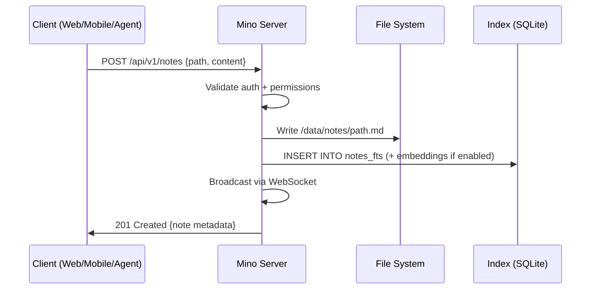

# 🟣 Mino — Master Plan

> A comprehensive, end-to-end blueprint for building the Mino knowledge platform.
> This document covers **every** architectural decision, design choice, tech stack recommendation, security consideration, and development strategy.

---

## Table of Contents

1. [Vision & Core Philosophy](#1-vision--core-philosophy)
2. [Design System](#2-design-system)
3. [Technology Stack](#3-technology-stack)
4. [Architecture Deep-Dive](#4-architecture-deep-dive)
5. [The Mino Server](#5-the-mino-server)
6. [The Web Interface (mino.ink)](#6-the-web-interface-minoink)
7. [Mobile Apps (iOS & Android)](#7-mobile-apps-ios--android)
8. [The AI Agent ("The Organizer")](#8-the-ai-agent-the-organizer)
9. [Plugins & Integrations](#9-plugins--integrations)
10. [API Design](#10-api-design)
11. [MCP Tools & Agent SDK](#11-mcp-tools--agent-sdk)
12. [Security Architecture](#12-security-architecture)
13. [Code Organization & Quality](#13-code-organization--quality)
14. [Data Storage & Indexing Strategy](#14-data-storage--indexing-strategy)
15. [Offline-First & Sync Strategy](#15-offline-first--sync-strategy)
16. [Deployment & Self-Hosting](#16-deployment--self-hosting)
17. [Phased Implementation Roadmap](#17-phased-implementation-roadmap)
18. [Design Reference & Inspiration](#18-design-reference--inspiration)
19. [Risk Analysis & Mitigation](#19-risk-analysis--mitigation)
20. [Open Questions & Decision Log](#20-open-questions--decision-log)

---

## 1. Vision & Core Philosophy

### What Mino Is

Mino is an **open-source, markdown-based knowledge platform** where your notes live as plain `.md` files in folder trees, managed by a server, accessible through beautiful interfaces, and maintained by AI agents.

### Three Pillars

| Pillar | Meaning |
|--------|---------|
| **Modularity** | Server, web, mobile, agent — all independent. Swap any piece. |
| **Agent-Native** | The AI coding agent is not bolted on — it's the primary way power users interact. The API is designed for agents first, humans second. |
| **Open-Source First** | Every component is open-source. Documentation is a first-class product. Self-hosting is trivially easy. |

### Target Audience

1. **Primary:** Developers who use AI coding agents (Antigravity, Cursor, Claude Code, Windsurf) and want their knowledge base to be agent-accessible and agent-maintained.
2. **Secondary:** Technical knowledge workers who want a self-hosted, privacy-first alternative to Notion/Obsidian with AI superpowers.
3. **Tertiary:** Teams and organizations wanting a shared knowledge base with AI-powered organization.

### The Key Insight

Most note-taking apps treat AI as a feature. **Mino treats the AI agent as a first-class user.** The API, the file structure, the search capabilities — everything is designed so that an AI agent can efficiently navigate, understand, modify, and organize a vault of thousands of notes with minimal token usage and maximum accuracy.

---

## 2. Design System

### 2.1 Design Philosophy

Derived from the **Mino logo** ([logo.svg](file:///Users/tom/Desktop/VS%20Code/Mino%20new/logo.svg)), the mino.ink website, the screen.png mockup, and the workspace prototypes:

- **Glassmorphism** — Frosted glass panels with `backdrop-filter: blur()`, translucent backgrounds (`bg-white/[0.03]` to `bg-white/[0.08]`), and subtle borders (`border-white/5`)
- **Dark-first** — Warm charcoal backgrounds (`#1E1E1E` from logo) as the default, with light mode as an option
- **Lavender-purple accent** — The brand purple `#BB86FC` (from logo.svg) as the singular identity color, with a full derived scale
- **All-rounded geometry** — No sharp edges anywhere. The logo uses only ellipses and circles; every UI element follows with generous `border-radius`
- **Spatial depth** — Multiple layers of transparency, glows, and shadows to create visual hierarchy
- **Micro-animations** — Subtle transitions, hover effects, floating elements, and pulse glows

### 2.2 Color Palette

```css
/* === MINO DESIGN TOKENS === */
/* Source of truth: logo.svg (#BB86FC purple, #1E1E1E dark circle) */

/* Background Scale (Dark Mode) — derived from logo #1E1E1E */
--mino-bg-base:     #121212;    /* Deepest background (near-black) */
--mino-bg-surface:  #1E1E1E;    /* Card/panel backgrounds (logo circle) */
--mino-bg-elevated: #2A2A2A;    /* Elevated surfaces */
--mino-bg-hover:    #353535;    /* Hover states */
--mino-bg-active:   #404040;    /* Active/selected states */

/* Background Scale (Light Mode) */
--mino-bg-base-light:     #FFFFFF;
--mino-bg-surface-light:  #FAFAFA;
--mino-bg-elevated-light: #F3F0FF;  /* Faint purple tint */

/* Purple Accent Scale — centered on logo #BB86FC */
--mino-purple-50:   #F5F0FF;    /* Lightest tint */
--mino-purple-100:  #E8DBFF;
--mino-purple-200:  #D4BFFF;
--mino-purple-300:  #C4A6FE;
--mino-purple-400:  #BB86FC;    /* ★ BRAND PRIMARY (logo color) */
--mino-purple-500:  #A96EF5;    /* Slightly deeper interactive */
--mino-purple-600:  #9B5DE5;    /* Primary buttons */
--mino-purple-700:  #7E3FCC;    /* Hover states */
--mino-purple-800:  #6229A8;
--mino-purple-900:  #481985;
--mino-purple-950:  #2D0F54;    /* Darkest shade */

/* Text */
--mino-text-primary:   rgba(255, 255, 255, 1.0);
--mino-text-secondary: rgba(255, 255, 255, 0.6);
--mino-text-tertiary:  rgba(255, 255, 255, 0.4);
--mino-text-muted:     rgba(255, 255, 255, 0.2);

/* Semantic */
--mino-success: #22C55E;
--mino-warning: #EAB308;
--mino-error:   #EF4444;
--mino-info:    #3B82F6;

/* Glass Effects */
--mino-glass-bg:     rgba(255, 255, 255, 0.04);
--mino-glass-border: rgba(187, 134, 252, 0.08);  /* Purple-tinted borders */
--mino-glass-blur:   blur(16px);

/* Glow Effects — using logo purple #BB86FC */
--mino-glow:    0 0 30px -5px rgba(187, 134, 252, 0.35);
--mino-glow-lg: 0 0 60px -10px rgba(187, 134, 252, 0.25);
```

### 2.3 Typography

| Element | Font | Weight | Size |
|---------|------|--------|------|
| Display / Headings | Space Grotesk | 600-700 | 24-48px |
| Body / UI | Inter | 400-500 | 14-16px |
| Code / Markdown | JetBrains Mono | 400 | 13-14px |

### 2.4 Component Language

- **Buttons:** Fully rounded (`border-radius: 12-16px`), primary = solid `#BB86FC` purple, secondary = ghost with `rgba(187, 134, 252, 0.1)` border
- **Cards:** Large radius (`20-28px`), glass background, purple-tinted border, hover glow
- **Navigation:** Fluid floating navbar (from mino.ink), pill-shaped active indicators in `#BB86FC`
- **Sidebar:** Collapsible, glass background on `#1E1E1E` surface, file tree with folder/file icons
- **Editor:** Full-width markdown with line numbers, code block syntax highlighting, WYSIWYG toggle
- **Status bar:** Bottom bar with sync status, word count, cursor position (from screen.png mockup)
- **Action toolbar:** Floating right-side buttons for text, image, link, AI actions (from screen.png)
- **All corners:** Generously rounded everywhere — following the logo's elliptical, zero-sharp-edge philosophy

### 2.5 Logo Usage

The Mino logo is three vertical ellipses of varying heights inside a dark circle, forming a stylized **M** resembling a sound wave:

```svg
<!-- logo.svg: 200×200 viewBox -->
<circle cx="100" cy="100" r="95" fill="#1E1E1E" />       <!-- Dark container -->
<ellipse cx="50"  cy="100" rx="17" ry="50" fill="#BB86FC" /> <!-- Left pill -->
<ellipse cx="100" cy="100" rx="20" ry="70" fill="#BB86FC" /> <!-- Center (taller) -->
<ellipse cx="150" cy="100" rx="17" ry="50" fill="#BB86FC" /> <!-- Right pill -->
```

**Usage rules:**
- **Primary mark:** Three-pill icon on dark circle (use as-is from `logo.svg`)
- **Wordmark:** Three-pill icon + "ino" in Space Grotesk 600 weight
- **Minimum size:** 24×24px for icon, 80px wide for wordmark
- **Clear space:** Minimum padding = 25% of logo width on all sides
- **Color variants:** Purple on dark (`#BB86FC` on `#1E1E1E`), purple on black (`#BB86FC` on `#121212`), monochrome white on dark for loading states
- **Never:** Stretch, rotate, add outlines, change pill proportions, or use non-brand colors

### 2.6 Design File Deliverable

A `design-tokens.css` file will be created containing all CSS custom properties, and a `tailwind.preset.js` extending Tailwind with the Mino theme. All components across web and mobile will consume these tokens for guaranteed consistency.

---

## 3. Technology Stack

### 3.1 Recommended Stack

After analyzing the existing prototypes and evaluating options for modularity, performance, developer experience, and long-term scalability:

| Component | Technology | Rationale |
|-----------|------------|-----------|
| **Server Runtime** | **Bun** | 3x faster than Node.js for I/O, native TypeScript, built-in SQLite, single binary deploys, excellent DX |
| **Server Framework** | **Hono** | Ultra-lightweight (14KB), works everywhere (Bun/Node/Deno/Cloudflare), type-safe middleware, OpenAPI generation |
| **Web Framework** | **Next.js 15 (App Router)** | SSR for SEO (landing/docs), RSC for performance, massive ecosystem, Vercel deployment option |
| **UI Components** | **shadcn/ui + Radix UI** | Accessible, composable, unstyled primitives. Already used in both prototypes. |
| **Styling** | **Tailwind CSS 4** | Utility-first, design token support, excellent with shadcn/ui |
| **Mobile** | **React Native + Expo** | Cross-platform iOS/Android, shared business logic with web, offline-first capabilities, OTA updates |
| **State Management** | **Zustand** | Minimal, unopinionated, works well with React and React Native |
| **Database (Index)** | **SQLite (via Bun built-in)** | Zero-config, embedded, incredibly fast for read-heavy workloads, portable, FTS5 for full-text search |
| **Data Storage** | **File system (markdown files)** | The core data IS the files. SQLite indexes them, but the source of truth is always the `.md` files on disk. |
| **Search** | **SQLite FTS5 + vector embeddings** | FTS5 for instant full-text search, optional embeddings (via `sqlite-vec`) for semantic search |
| **Auth** | **JWT (self-hosted) + OAuth 2.0 (hosted)** | JWT for API access, Google OAuth for managed service |
| **Real-time Sync** | **WebSocket + Yjs (CRDTs)** | Conflict-free offline-first sync across devices |
| **AI/LLM** | **Model-agnostic (OpenAI, Anthropic, Google, local)** | User chooses their provider. Server proxies requests. |
| **Monorepo** | **pnpm workspaces + Turborepo** | Shared types, shared components, efficient builds |
| **Testing** | **Vitest + Playwright** | Fast unit tests, reliable E2E |
| **CI/CD** | **GitHub Actions** | Standard, free for open-source |
| **Docs** | **Mintlify or Starlight** | Beautiful API docs from OpenAPI spec |

### 3.2 Why NOT Other Options?

| Rejected | Reason |
|----------|--------|
| **Go for server** | Great performance, but TypeScript everywhere (server → web → mobile) enables massive code sharing. Type-safe API contracts via shared packages. |
| **Flutter for mobile** | No code sharing with the web stack. React Native + Expo means shared components, hooks, and business logic between web and mobile. |
| **PostgreSQL** | Overkill for a note-taking app. SQLite is embeddable, zero-config, portable, and perfect for self-hosting. One file = your entire index. |
| **MongoDB/NoSQL** | Notes are files. The index database should be relational (tags, folders, links between notes). SQLite is ideal. |
| **Prisma ORM** | Too heavy for SQLite. Use `drizzle-orm` or raw `bun:sqlite` — faster, lighter, better SQLite support. |
| **Vanilla CSS** | Too much boilerplate for a large consistent design system. Tailwind + design tokens is the pragmatic choice. |

### 3.3 Monorepo Structure

```
mino/
├── packages/
│   ├── shared/              # Shared types, utils, API contracts
│   │   ├── types/           # TypeScript types (Note, Folder, User, etc.)
│   │   ├── api-client/      # Type-safe API client (used by web + mobile)
│   │   ├── markdown/        # Markdown parsing/rendering utilities
│   │   └── design-tokens/   # CSS variables, Tailwind preset
│   └── ui/                  # Shared React components (works in web + RN)
│       ├── primitives/      # Button, Input, Card, etc.
│       └── features/        # Editor, Sidebar, NoteList, etc.
├── apps/
│   ├── server/              # Bun + Hono API server
│   ├── web/                 # Next.js web application
│   └── mobile/              # React Native + Expo app
├── tools/
│   ├── mcp-server/          # MCP tool server for AI agents
│   └── cli/                 # CLI tool for server management
├── docs/                    # Documentation site
├── docker/                  # Docker configs
├── pnpm-workspace.yaml
├── turbo.json
├── README.md
└── MASTER_PLAN.md           # This file
```

---

## 4. Architecture Deep-Dive

### 4.1 The Three-Layer Model

```
┌─ Layer 1: INTERFACES ──────────────────────────────────────┐
│  Web App │ Mobile App │ CLI │ MCP Tools │ Raw API Clients   │
│  (Next.js)  (Expo/RN)   (Bun)  (Agent SDK)  (curl/fetch)  │
└───────────────────────────┬─────────────────────────────────┘
                            │  HTTPS + WebSocket
                            ▼
┌─ Layer 2: MINO SERVER ──────────────────────────────────────┐
│                                                              │
│  ┌─────────────┐  ┌──────────────┐  ┌──────────────────┐   │
│  │  HTTP Router │  │  WebSocket   │  │  Agent Runtime   │   │
│  │  (Hono)      │  │  (ws + Yjs)  │  │  (LLM + Tools)   │   │
│  └──────┬───────┘  └──────┬───────┘  └────────┬─────────┘   │
│         │                 │                    │              │
│  ┌──────┴─────────────────┴────────────────────┴─────────┐  │
│  │                   SERVICE LAYER                         │  │
│  │  NoteService │ FolderService │ SearchService │ Auth     │  │
│  └──────────────────────┬──────────────────────────────────┘  │
│                         │                                     │
│  ┌──────────────────────┴──────────────────────────────────┐  │
│  │                   DATA LAYER                             │  │
│  │    FileManager (R/W .md)  │  IndexDB (SQLite FTS+Vec)   │  │
│  └──────────────────────────────────────────────────────────┘  │
│                                                              │
└─ Layer 3: STORAGE ───────────────────────────────────────────┘
   📁 /data/notes/**/*.md       (source of truth)
   📁 /data/assets/**           (images, attachments)
   📁 /data/mino.db             (SQLite index)
   📁 /data/config.json         (server config)
```

### 4.2 Data Flow: How a Note Gets Created



### 4.3 Multi-Server Architecture

Users can run multiple independent Mino servers:

```
Server A (Personal)          Server B (Work)           Server C (Shared Team)
  └── ~/personal-notes/        └── ~/work-notes/          └── /shared/team-notes/
        ↓                            ↓                            ↓
  https://home.mino.ink       https://work.mino.ink       https://team.mino.ink
        ↓                            ↓                            ↓
  ┌─── Mobile App (switch between servers in settings) ──────────────┐
  │  Server picker → select endpoint → enter API key → connected    │
  └──────────────────────────────────────────────────────────────────┘
```

---

## 5. The Mino Server

### 5.1 Core Responsibilities

1. **File Management** — CRUD operations on `.md` files and folders
2. **Indexing** — Maintain SQLite FTS5 index of all note content, titles, tags, links
3. **Search** — Full-text search, tag search, semantic search (embeddings)
4. **Authentication** — JWT tokens, API keys, OAuth proxy
5. **Real-time Sync** — WebSocket connections for live collaboration and sync
6. **Agent Runtime** — Host the AI organizer agent (optional, can be disabled)
7. **Plugin Host** — Load and execute plugins (web search, email import, etc.)

### 5.2 File Watcher

The server watches the file system for changes (using `fs.watch` or `chokidar`):

```
User edits file via VS Code/git/external editor
  → File watcher detects change
    → Re-index the file in SQLite
      → Broadcast change via WebSocket to connected clients
```

This is critical: notes can be edited OUTSIDE of Mino (in any text editor, via git, via coding agents) and the server stays in sync.

### 5.3 Configuration

```jsonc
// /data/config.json
{
  "server": {
    "port": 3000,
    "host": "0.0.0.0",
    "cors": ["https://mino.ink"]
  },
  "auth": {
    "mode": "jwt",                // "jwt" | "api-key" | "oauth" | "none"
    "jwtSecret": "...",
    "oauthProviders": ["google"]
  },
  "agent": {
    "enabled": true,
    "model": "anthropic/claude-sonnet-4-20250514",
    "apiKey": "...",
    "maxTokensPerRequest": 4096
  },
  "search": {
    "fts": true,
    "embeddings": true,
    "embeddingModel": "text-embedding-3-small"
  },
  "sync": {
    "websocket": true,
    "fileWatcher": true
  },
  "plugins": {
    "enabled": ["web-search", "youtube-transcript"],
    "directory": "./plugins"
  }
}
```

---

## 6. The Web Interface (mino.ink)

### 6.1 Page Structure

| Page | Path | Description |
|------|------|-------------|
| **Landing** | `/` | Marketing site with features, use cases, pricing |
| **Login** | `/login` | Email/password or Google OAuth |
| **Workspace** | `/w/:workspace` | Main editor + sidebar + note list |
| **Settings** | `/settings` | Server connection, theme, plugins, agent config |
| **API Docs** | `/docs` | Interactive API documentation |

### 6.2 Workspace Layout (from screen.png mockup)

```
┌─────────────────────────────────────────────────────────────┐
│  [≡] WORKSPACE               [👤+3] [Share] [Publish]       │
├────────────┬────────────────────────────────────────────┬────┤
│            │  Projects > Project_Alpha.md               │    │
│  📁 Projects│                                           │ [A]│
│   ├─ Project │  1  # Project Alpha: System Architecture │ [🖼]│
│   ├─ Roadmap │  2                                       │ [🔗]│
│  📁 Daily    │  3  ## Core Objectives                   │ [✏]│
│   ├─ Personal│  4  - Establish robust sync using CRDTs. │    │
│   └─ Ideas   │  5  - Implement end-to-end encryption.   │    │
│  📁 Archive  │  ...                                      │    │
│            │                                             │    │
│ [⚙] [👥]  │                                             │    │
│ Storage 42%│  ● SYNCED  UTF-8  <> MARKDOWN  1,242 WORDS │    │
└────────────┴─────────────────────────────────────────────┴────┘
```

### 6.3 Key UI Features

- **Fluid navbar** — Floating, glass-effect navbar from mino.ink with pill-shaped active indicators
- **Split-pane editor** — Resizable panels (sidebar / note list / editor) using `react-resizable-panels`
- **Real-time markdown** — Live preview with syntax highlighting via `react-markdown` + `react-syntax-highlighter`
- **Command palette** — `Cmd+K` to search notes, run commands, switch servers (using `cmdk`)
- **File tree** — Collapsible folder tree with drag-and-drop reordering (using `@dnd-kit`)
- **AI chat panel** — Slide-out panel to chat with the AI organizer
- **Theme switching** — Dark/light mode with smooth transitions (using `next-themes`)
- **Status bar** — Sync status, word count, encoding, cursor position (inspired by VS Code)
- **Collaboration cursors** — Show other users' cursors in real-time (Yjs awareness)

### 6.4 Landing Page Design

Keep the existing mino.ink design language, updated with logo-derived brand colors:
- Deep dark background (`#121212` base, `#1E1E1E` surfaces)
- `#BB86FC` purple gradient orbs with blur effects
- Grid pattern overlay with faint purple tint
- Mouse-reactive parallax elements
- Feature cards with glass effect and purple-tinted borders
- The Mino logo (three vertical pills + "ino" text) from `logo.svg`

---

## 7. Mobile Apps (iOS & Android)

### 7.1 Technology Choice: React Native + Expo

**Why not Flutter?** React Native + Expo enables:
- Shared TypeScript types with the server
- Shared API client with the web app
- Shared markdown parsing logic
- Shared React components (via `react-native-web` bridge)
- OTA updates without app store review
- Single codebase for iOS + Android

### 7.2 Mobile Architecture

```
┌─ Mobile App ──────────────────────────────────────────┐
│                                                        │
│  ┌──────────────────────────────────────────────┐     │
│  │           UI Layer (React Native)             │     │
│  │  NoteList │ Editor │ Search │ Settings │ Chat │     │
│  └──────────────────┬───────────────────────────┘     │
│                      │                                 │
│  ┌──────────────────┴───────────────────────────┐     │
│  │           State (Zustand + Yjs)               │     │
│  └──────────────────┬───────────────────────────┘     │
│                      │                                 │
│  ┌──────────────────┴───────────────────────────┐     │
│  │           Local Storage (SQLite via expo)     │     │
│  │  Full offline copy of all notes + index       │     │
│  └──────────────────┬───────────────────────────┘     │
│                      │                                 │
│  ┌──────────────────┴───────────────────────────┐     │
│  │           Sync Engine (Yjs + WebSocket)        │     │
│  │  Offline queue → sync when online              │     │
│  └──────────────────────────────────────────────┘     │
│                                                        │
└────────────────────────────────────────────────────────┘
```

### 7.3 Offline-First

- All notes are stored locally in SQLite on the device
- Edits are queued when offline and synced via CRDTs when reconnected
- Conflict resolution is automatic (Yjs CRDT)
- Server selector in settings lets users point to ANY Mino server

### 7.4 Multi-Server Support

The mobile app maintains a list of connected servers:

```typescript
interface ServerConfig {
  id: string;
  name: string;            // "Personal", "Work", etc.
  endpoint: string;        // "https://my-server.com"
  authToken: string;       // JWT or API key
  syncEnabled: boolean;
  lastSyncedAt: Date;
}
```

Users can switch between servers or view notes from all servers in a unified view.

---

## 8. The AI Agent ("The Organizer")

This is the **killer feature** of Mino. Inspired heavily by the OpenClaw architecture (studied in the `openclaw/` repo), but focused specifically on knowledge management rather than general-purpose assistance.

### 8.1 What the Agent Does

The agent is a **knowledge steward**, not a general-purpose chatbot. Its job:

1. **Organize** — Auto-tag, categorize, and file notes into the right folders
2. **Connect** — Find and create links between related notes (like Obsidian's graph view, but automatic)
3. **Summarize** — Create summaries, indexes, and MOC (map of content) notes
4. **Clean** — Find duplicate notes, merge related ones, archive stale ones
5. **Answer** — When asked a question, search through all notes and synthesize an answer
6. **Import** — Process imports (web pages, emails, voice memos) into properly formatted notes

### 8.2 Agent Architecture (from OpenClaw learnings)

```
┌─ Agent Runtime ──────────────────────────────────────────┐
│                                                           │
│  ┌───────────────────────────────────────────────────┐   │
│  │                   LLM (Claude / GPT / etc.)        │   │
│  │  System prompt + context window                    │   │
│  └──────────────────────┬────────────────────────────┘   │
│                          │                                │
│  ┌──────────────────────┴────────────────────────────┐   │
│  │                 TOOL LAYER                          │   │
│  │                                                     │   │
│  │  mino.search      — full-text + semantic search     │   │
│  │  mino.read         — read a specific note           │   │
│  │  mino.write        — create/replace a note          │   │
│  │  mino.edit         — search-and-replace in a note   │   │
│  │  mino.move         — move/rename a note             │   │
│  │  mino.delete       — delete a note (with safeguard) │   │
│  │  mino.tree         — get the folder structure       │   │
│  │  mino.tags         — list/manage tags               │   │
│  │  mino.recent       — get recently modified notes    │   │
│  │  mino.links        — find backlinks / forward links │   │
│  │  web.search        — search the web (plugin)        │   │
│  │  youtube.transcript— get video transcript (plugin)  │   │
│  │  email.fetch       — fetch emails (plugin)          │   │
│  └───────────────────────────────────────────────────┘   │
│                                                           │
│  ┌───────────────────────────────────────────────────┐   │
│  │                 CONTEXT STRATEGY                    │   │
│  │                                                     │   │
│  │  1. Always inject: folder tree (compacted)          │   │
│  │  2. Always inject: recent notes list (last 10)      │   │
│  │  3. On search: return snippets, not full files      │   │
│  │  4. On read: return full file content               │   │
│  │  5. On edit: use search-and-replace (not full file) │   │
│  │  6. Limit context to ~8K tokens per tool call       │   │
│  └───────────────────────────────────────────────────┘   │
│                                                           │
└───────────────────────────────────────────────────────────┘
```

### 8.3 Token Efficiency Strategy

This is critical for cost and speed. Lessons from OpenClaw:

| Strategy | Description | Token Savings |
|----------|-------------|---------------|
| **Compact file tree** | Send folder names + file count, not every filename. Expand on demand. | ~80% vs full tree |
| **Snippet search** | Return 200-char snippets around matches, not full files | ~90% vs full files |
| **Search-and-replace edits** | Never send the full file to modify. Use `mino.edit(path, oldText, newText)` | ~95% vs full file |
| **Embeddings pre-filter** | Use vector similarity to find the right 5 notes out of 10,000 before reading them | ~99% vs reading all |
| **Session memory** | Maintain a compact summary of what the agent already knows about the vault | Avoids re-reading |
| **Tool result caching** | Cache file tree and recent search results within a session | ~50% on repeat queries |

### 8.4 How the Agent Should Search

A two-phase search strategy:

1. **Phase 1: Title + Tag match** — Fast. Search note titles and tags. Costs ~0 tokens (local SQLite query).
2. **Phase 2: Full-text search** — Search note content via FTS5. Return snippets. Costs ~500 tokens.
3. **Phase 3: Semantic search** — If Phase 1+2 don't find it, use embedding similarity. Costs ~200 tokens for the query embedding.
4. **Phase 4: Read** — Only read the full file when the agent is confident it's the right one.

### 8.5 How the Agent Should Modify

```
Agent decision tree for modifications:

1. Small edit (fix typo, add tag, update a line)?
   → Use mino.edit(path, oldText, newText)  ← PREFERRED

2. Add content to existing note?
   → Use mino.edit(path, "<!-- END -->", "new content\n<!-- END -->")

3. Create new note?
   → Use mino.write(path, content)

4. Restructure a note completely?
   → Use mino.write(path, entireNewContent)  ← EXPENSIVE, avoid

5. Delete a note?
   → Use mino.delete(path) — but ALWAYS confirm with user first
   → Unless the agent has explicit "auto-delete" permission
```

### 8.6 File Tree Context Size

The agent always gets a **compacted** file tree:

```
📁 Projects/ (12 files)
  📁 Alpha/ (5 files)
  📁 Beta/ (3 files)
  📁 Archive/ (4 files)
📁 Daily Notes/ (89 files)
📁 References/ (23 files)
📁 Personal/ (7 files)
```

Instead of listing all 131 individual files. The agent can "drill down" by calling `mino.tree("Projects/Alpha")` to see the files in a specific folder.

### 8.7 Agent Permissions Model

| Permission | Description | Default |
|------------|-------------|---------|
| `read` | Read any note | ✅ Enabled |
| `search` | Search across notes | ✅ Enabled |
| `write` | Create new notes | ✅ Enabled |
| `edit` | Modify existing notes | ✅ Enabled |
| `move` | Move/rename notes | ✅ Enabled |
| `delete` | Delete notes | ❌ Disabled (requires explicit enable) |
| `organize` | Auto-organize (batch operations) | ❌ Disabled |
| `scope` | Restrict to specific folders | All folders |

---

## 9. Plugins & Integrations

### 9.1 Plugin Architecture

Plugins extend the agent's capabilities. Each plugin is an npm package that exports tools:

```typescript
// @mino-ink/plugin-web-search/index.ts
import { definePlugin } from '@mino-ink/plugin-sdk';

export default definePlugin({
  name: 'web-search',
  description: 'Search the web and save results as notes',
  tools: [
    {
      name: 'web_search',
      description: 'Search the web for information',
      parameters: {
        query: { type: 'string', description: 'Search query' },
        maxResults: { type: 'number', default: 5 },
      },
      execute: async ({ query, maxResults }) => {
        // ... implementation
      },
    },
  ],
});
```

### 9.2 Planned Plugins

| Plugin | Description | Priority |
|--------|-------------|----------|
| **Web Search** | Search the web via Perplexity/Google/DuckDuckGo | P0 |
| **YouTube Transcript** | Import video transcripts as notes | P1 |
| **Email Import** | Import emails (Gmail API) as notes | P1 |
| **Voice Notes** | Speech-to-text via Whisper | P1 |
| **Image OCR** | Extract text from images | P2 |
| **RSS/News** | Follow feeds and clip articles | P2 |
| **Social Media** | Save tweets/posts/threads | P2 |
| **Calendar** | Import calendar events as daily notes | P2 |
| **Git Integration** | Auto-commit note changes to a git repo | P1 |
| **Obsidian Import** | Import existing Obsidian vaults | P0 |

### 9.3 MCP Integration

Every Mino server can expose its API as an **MCP (Model Context Protocol) server**, so AI agents like Antigravity, Cursor, and Claude Code can directly read/write notes:

```bash
# Start the MCP server
npx @mino-ink/mcp-server \
  --endpoint https://your-server.com \
  --api-key YOUR_KEY
```

The MCP server exposes these tools to any connected agent:

- `mino_search` — Search notes
- `mino_read` — Read a note
- `mino_write` — Create/update a note
- `mino_edit` — Edit part of a note
- `mino_tree` — Get folder structure
- `mino_move` — Move/rename a note
- `mino_delete` — Delete a note

---

## 10. API Design

### 10.1 Design Principles

1. **RESTful** for CRUD operations
2. **WebSocket** for real-time sync and collaboration
3. **OpenAPI 3.1** spec auto-generated from code (Hono + Zod)
4. **Versioned** — all routes under `/api/v1/`
5. **Consistent error format** — `{ error: { code, message, details } }`
6. **Pagination** — cursor-based for lists
7. **Rate limiting** — per-API-key, configurable

### 10.2 API Endpoints

```yaml
# === NOTES ===
GET    /api/v1/notes                     # List notes (paginated, filterable)
GET    /api/v1/notes/:path               # Get note content + metadata
POST   /api/v1/notes                     # Create a new note
PUT    /api/v1/notes/:path               # Replace entire note content
PATCH  /api/v1/notes/:path               # Partial update (frontmatter, content section)
DELETE /api/v1/notes/:path               # Delete note (soft delete by default)
PATCH  /api/v1/notes/:path/move          # Move/rename note

# === SEARCH ===
GET    /api/v1/search?q=...&limit=...    # Full-text search
POST   /api/v1/search/semantic           # Semantic search (embeddings)

# === FOLDERS ===
GET    /api/v1/tree                      # Get entire folder tree (compacted)
GET    /api/v1/tree/:path                # Get subtree
POST   /api/v1/folders                   # Create folder
DELETE /api/v1/folders/:path             # Delete folder (+ contents)

# === TAGS ===
GET    /api/v1/tags                      # List all tags with counts
GET    /api/v1/tags/:tag/notes           # Get notes with specific tag

# === AGENT ===
POST   /api/v1/agent/chat               # Send message to AI agent
GET    /api/v1/agent/suggestions         # Get organization suggestions
POST   /api/v1/agent/organize            # Trigger auto-organization

# === AUTH ===
POST   /api/v1/auth/login               # Login (email/password)
POST   /api/v1/auth/register            # Register
POST   /api/v1/auth/refresh             # Refresh JWT token
POST   /api/v1/auth/api-keys            # Generate API key
DELETE /api/v1/auth/api-keys/:id        # Revoke API key
GET    /api/v1/auth/oauth/google        # Google OAuth redirect

# === SYSTEM ===
GET    /api/v1/health                    # Health check
GET    /api/v1/stats                     # Server stats (note count, storage)
GET    /api/v1/config                    # Public server config
```

### 10.3 Note Object Schema

```typescript
interface Note {
  path: string;              // "Projects/Alpha/architecture.md"
  title: string;             // "Architecture"
  content: string;           // Raw markdown content
  frontmatter: Record<string, unknown>;  // YAML frontmatter
  tags: string[];            // ["project", "architecture"]
  links: string[];           // Outgoing links to other notes
  backlinks: string[];       // Notes that link to this one
  wordCount: number;
  createdAt: string;         // ISO 8601
  updatedAt: string;
  checksum: string;          // Content hash for sync
}
```

---

## 11. MCP Tools & Agent SDK

### 11.1 MCP Server Implementation

The MCP server acts as a bridge between AI coding agents and the Mino API:

```typescript
// @mino-ink/mcp-server
import { McpServer } from '@modelcontextprotocol/sdk/server';

const server = new McpServer({
  name: 'mino',
  version: '1.0.0',
  tools: [
    {
      name: 'mino_search',
      description: 'Search notes by query. Returns snippets, not full content.',
      inputSchema: {
        type: 'object',
        properties: {
          query: { type: 'string' },
          limit: { type: 'number', default: 10 },
          folder: { type: 'string', description: 'Restrict to folder' },
        },
        required: ['query'],
      },
      handler: async ({ query, limit, folder }) => {
        // Call Mino API: GET /api/v1/search?q=...
      },
    },
    // ... more tools
  ],
  resources: [
    {
      uri: 'mino://tree',
      name: 'Mino File Tree',
      description: 'The folder structure of the notes vault',
      handler: async () => {
        // Call Mino API: GET /api/v1/tree
      },
    },
  ],
});
```

### 11.2 Agent SDK for Custom Integrations

For developers who want to build their own integrations:

```typescript
import { MinoClient } from '@mino-ink/sdk';

const mino = new MinoClient({
  endpoint: 'https://my-mino.com',
  apiKey: 'mino_...',
});

// Search
const results = await mino.search('meeting notes', { limit: 5 });

// Read
const note = await mino.notes.get('Projects/Alpha/notes.md');

// Write
await mino.notes.create('Daily/2026-02-11.md', '# Today\n- Planning Mino');

// Edit (search-and-replace)
await mino.notes.edit('Projects/Alpha/notes.md', {
  find: '## Status: In Progress',
  replace: '## Status: Complete',
});
```

---

## 12. Security Architecture

### 12.1 Authentication Layers

```
┌─ Request Flow ──────────────────────────────────────────────┐
│                                                              │
│  Client → HTTPS → Rate Limiter → Auth Middleware → Router   │
│                                                              │
│  Auth Methods:                                               │
│  ┌──────────────────────────────────────────────────────┐   │
│  │ 1. JWT Bearer Token (web/mobile sessions)             │   │
│  │ 2. API Key (header: X-Mino-Key, for agents/scripts)  │   │
│  │ 3. OAuth 2.0 (Google, for managed mino.ink service)   │   │
│  └──────────────────────────────────────────────────────┘   │
│                                                              │
│  Each auth method resolves to a User + Permission Set        │
└──────────────────────────────────────────────────────────────┘
```

### 12.2 Security Hardening Checklist

| Measure | Implementation |
|---------|---------------|
| **Transport encryption** | HTTPS everywhere (TLS 1.3). No plain HTTP in production. |
| **Authentication** | JWT with short expiry (15min) + refresh tokens (7 days). API keys for machine access. |
| **Authorization** | Role-based: `owner`, `editor`, `viewer`, `agent`. Folder-level permissions. |
| **Input validation** | All inputs validated via Zod schemas. Markdown content sanitized on render (not on store). |
| **Path traversal** | All file paths normalized and validated against the data directory. No `../` escapes. |
| **Rate limiting** | Per-IP and per-API-key rate limits. Configurable. |
| **CORS** | Strict origin allowlist. No `*` in production. |
| **Content Security Policy** | Strict CSP headers on the web app. |
| **Dependency security** | Automated dependency scanning (Dependabot/Renovate). Minimal dependency tree. |
| **Secrets management** | API keys hashed (bcrypt). JWT secrets rotatable. No secrets in git. |
| **Audit logging** | Log all write operations with timestamp, user, and action. |
| **End-to-end encryption** | Optional client-side encryption for sensitive notes (using Web Crypto API). |
| **SQL injection** | Parameterized queries only (enforced by drizzle-orm/Bun SQLite API). |
| **XSS** | Markdown rendered safely via `react-markdown` with sanitization. No `dangerouslySetInnerHTML`. |

### 12.3 Self-Hosted Security

For self-hosted instances:

1. **Network:** Bind to `127.0.0.1` by default. Use a reverse proxy (Caddy/nginx) for HTTPS.
2. **Firewall:** Only expose port 443 (HTTPS). Everything else behind firewall.
3. **Updates:** Automated update check. One-command updates (`mino update`).
4. **Backups:** Built-in backup command (`mino backup`) that creates a `.tar.gz` of all data.

---

## 13. Code Organization & Quality

### 13.1 Consistency Guarantees

| Mechanism | Purpose |
|-----------|---------|
| **Shared types package** | `@mino-ink/shared` — all TypeScript interfaces shared between server, web, and mobile |
| **Shared API client** | Type-safe API client generated from OpenAPI spec, used by all clients |
| **Design tokens** | Single source of truth for colors, spacing, typography in `@mino-ink/design-tokens` |
| **Component library** | Shared React components in `@mino-ink/ui` |
| **Linting** | ESLint + Prettier + Oxlint with strict rules |
| **Formatting** | Automated via Prettier (enforced in CI) |

### 13.2 DRY & Modular Code Practices

1. **No duplicate logic:** All markdown parsing, API calls, and validation logic lives in shared packages.
2. **Composable services:** The server uses a dependency injection pattern — services are composable and testable.
3. **Feature modules:** Each feature (notes, search, agent, plugins) is a self-contained module with its own routes, services, and tests.
4. **No God files:** Maximum 500 LOC per file. Split into focused modules.

### 13.3 Testing Strategy

| Layer | Tool | What's Tested |
|-------|------|---------------|
| **Unit** | Vitest | Service logic, utilities, validation, markdown parsing |
| **Integration** | Vitest + Supertest | API endpoints, database operations, file operations |
| **E2E** | Playwright | Full user flows in the web app |
| **Mobile E2E** | Detox (or Maestro) | Full user flows in the mobile app |
| **Contract** | OpenAPI validator | API responses match the spec |
| **Performance** | k6 | API throughput, search latency |

### 13.4 CI/CD Pipeline

```yaml
# .github/workflows/ci.yml
on: [push, pull_request]

jobs:
  lint:     # ESLint + Prettier + Oxlint
  typecheck: # tsc --noEmit
  test:     # vitest run
  e2e:      # playwright test
  build:    # Build all packages
  docker:   # Build Docker image
  deploy:   # Deploy to staging (on main)
```

---

## 14. Data Storage & Indexing Strategy

### 14.1 The Hybrid Approach

**Source of truth:** `.md` files on disk
**Index for speed:** SQLite database

```
┌─────────────────────────────────────────────────┐
│                FILE SYSTEM (source of truth)      │
│                                                   │
│  /data/notes/                                     │
│  ├── Projects/                                    │
│  │   ├── Alpha/                                   │
│  │   │   ├── architecture.md                      │
│  │   │   └── meeting-2026-02-11.md                │
│  │   └── Beta/                                    │
│  │       └── roadmap.md                           │
│  └── Daily/                                       │
│      ├── 2026-02-11.md                            │
│      └── 2026-02-10.md                            │
│                                                   │
│  /data/assets/                                    │
│  ├── images/                                      │
│  └── attachments/                                 │
└──────────────────┬──────────────────────────────┘
                   │  File watcher + on-demand re-index
                   ▼
┌─────────────────────────────────────────────────┐
│               SQLite INDEX (derived, rebuildable)│
│                                                   │
│  notes table:                                     │
│    path, title, content_hash, tags, created,      │
│    modified, word_count, frontmatter_json          │
│                                                   │
│  notes_fts (FTS5 virtual table):                  │
│    title, content, tags                           │
│                                                   │
│  notes_vec (vector table, optional):              │
│    path, embedding (1536-dim float array)          │
│                                                   │
│  links table:                                     │
│    source_path, target_path                       │
│                                                   │
│  tags table:                                      │
│    tag, note_path                                  │
└─────────────────────────────────────────────────┘
```

### 14.2 Why Files + SQLite (Not a Database)

| Concern | Files + SQLite | Pure Database |
|---------|---------------|---------------|
| **Portability** | Copy folder = done. `scp`, `rsync`, `git`. | Need `pg_dump`, migration scripts |
| **Agent compatibility** | Agents already understand files and paths | Agents need ORM abstractions |
| **Git integration** | Native. Your notes are already a git repo. | Need export/import |
| **External editing** | Any text editor works (VS Code, vim, etc.) | Only through the app |
| **Backup** | `tar -czf notes-backup.tar.gz /data/notes` | Database dump + restore |
| **Speed** | FTS5 searches millions of rows in <10ms | About the same |
| **Rebuild** | Delete `mino.db`. Server re-indexes on boot. | Data loss risk |

### 14.3 Indexing Pipeline

On server start:
1. Walk the file tree
2. For each `.md` file: parse frontmatter, extract title/tags/links, compute content hash
3. Upsert into SQLite (skip if content hash unchanged)
4. Build FTS5 index
5. Optionally generate embeddings (async, background)

This takes <2 seconds for 10,000 notes on modern hardware.

### 14.4 Embedding Strategy

For semantic search:

- **Model:** `text-embedding-3-small` (OpenAI) or local `all-MiniLM-L6-v2` (sentence-transformers)
- **Storage:** `sqlite-vec` extension for SQLite vector similarity search
- **Chunking:** Split notes at heading boundaries. Each heading section = one embedding.
- **Updates:** Re-embed only changed files (compare content hash)
- **Cost:** ~$0.02 per 1,000 notes (OpenAI), free for local models

---

## 15. Offline-First & Sync Strategy

### 15.1 CRDT-Based Sync (Yjs)

```
Device A (offline)     Mino Server     Device B (online)
      │                     │                  │
      │── Edit note ──►     │                  │
      │   (queued)          │                  │
      │                     │── Edit same ──►  │
      │                     │   note           │
      │── Come online ──►   │                  │
      │   Send Yjs update   │                  │
      │                     │── Merge ──►      │
      │                     │   (CRDT)         │
      │◄── Merged state ──  │── Merged state ──│
      │                     │                  │
```

### 15.2 Sync Protocol

1. **Connect:** Client opens WebSocket to server
2. **Handshake:** Exchange vector clocks / state vectors
3. **Diff:** Server sends only the deltas since last sync
4. **Apply:** Client applies deltas locally (CRDT merge)
5. **Push:** Client sends its local deltas to server
6. **Continuous:** WebSocket stays open for real-time updates

### 15.3 Conflict Resolution

CRDTs guarantee that all devices converge to the same state, regardless of the order edits arrive. No manual conflict resolution needed.

For the rare case of irreconcilable conflicts (e.g., one device deleted a note while another edited it), the "edit wins" policy is applied — deletions are soft-deletes that can be recovered.

---

## 16. Deployment & Self-Hosting

### 16.1 Deployment Options

| Method | Complexity | Best For |
|--------|------------|----------|
| **Docker** | ⭐ Easy | Production self-hosting |
| **Single binary** | ⭐ Easy | Minimal servers, Raspberry Pi |
| **From source** | ⭐⭐ Medium | Development, customization |
| **Managed (mino.ink)** | ⭐ Easy | Users who don't want to self-host |

### 16.2 Docker Compose (Recommended Self-Host)

```yaml
# docker-compose.yml
version: "3.8"
services:
  mino:
    image: ghcr.io/mino-ink/mino-server:latest
    ports:
      - "3000:3000"
    volumes:
      - ./notes:/data/notes       # Your markdown files
      - ./mino-data:/data/db      # SQLite index + config
    environment:
      - MINO_AUTH_MODE=jwt
      - MINO_JWT_SECRET=change-me-in-production
      - MINO_AGENT_ENABLED=true
      - MINO_AGENT_API_KEY=sk-...  # Your LLM API key
    restart: unless-stopped

  # Optional: reverse proxy with automatic HTTPS
  caddy:
    image: caddy:latest
    ports:
      - "80:80"
      - "443:443"
    volumes:
      - ./Caddyfile:/etc/caddy/Caddyfile
```

### 16.3 One-Line Install

```bash
curl -fsSL https://mino.ink/install.sh | bash
```

This script:
1. Installs Docker if not present
2. Pulls the Mino server image
3. Creates the data directory
4. Starts the server
5. Prints the URL and default credentials

---

## 17. Phased Implementation Roadmap

### Phase 0: Foundation (Weeks 1-2)

- [ ] Set up monorepo structure (pnpm + Turborepo)
- [ ] Create `@mino-ink/shared` package (types, utils)
- [ ] Create `@mino-ink/design-tokens` (CSS variables, Tailwind preset)
- [ ] Set up CI/CD pipeline
- [ ] Write `design-tokens.css` and `tailwind.preset.js`

### Phase 1: Server Core (Weeks 3-5)

- [ ] Bun + Hono server scaffolding
- [ ] File system manager (CRUD on .md files)
- [ ] SQLite index with FTS5
- [ ] REST API for notes, folders, search
- [ ] JWT authentication
- [ ] File watcher for external changes
- [ ] API key authentication
- [ ] OpenAPI spec auto-generation
- [ ] Docker image

### Phase 2: Web App (Weeks 5-8)

- [ ] Next.js app with landing page (from mino.ink design)
- [ ] Authentication flows (login, register, Google OAuth)
- [ ] Workspace layout (sidebar + note list + editor)
- [ ] Markdown editor (CodeMirror 6 or TipTap)
- [ ] File tree with drag-and-drop
- [ ] Command palette (Cmd+K)
- [ ] Theme switching (dark/light)
- [ ] Real-time sync via WebSocket

### Phase 3: AI Agent (Weeks 8-11)

- [ ] Agent runtime with tool system
- [ ] Core tools (search, read, write, edit, move, tree)
- [ ] Context strategy (compact tree, snippets, search-and-replace)
- [ ] Chat panel in web app
- [ ] Auto-organization suggestions
- [ ] Permission model

### Phase 4: MCP & Agent SDK (Weeks 11-12)

- [ ] MCP server package
- [ ] TypeScript SDK for API access
- [ ] Documentation for agent integrations
- [ ] Example: Antigravity skill/MCP for Mino
- [ ] Example: Cursor rules for Mino

### Phase 5: Mobile App (Weeks 12-16)

- [ ] React Native + Expo setup
- [ ] Local SQLite for offline storage
- [ ] Yjs sync engine
- [ ] Note editor (mobile-optimized)
- [ ] File browser
- [ ] Multi-server picker
- [ ] Push notifications

### Phase 6: Plugins (Weeks 16-20)

- [ ] Plugin SDK and registry
- [ ] Web search plugin
- [ ] YouTube transcript plugin
- [ ] Voice notes plugin (Whisper)
- [ ] Email import plugin
- [ ] Obsidian vault import tool

### Phase 7: Polish & Launch (Weeks 20-24)

- [ ] Semantic search (embeddings)
- [ ] End-to-end encryption (optional)
- [ ] Performance optimization
- [ ] Security audit
- [ ] Documentation site
- [ ] Open-source launch (GitHub, Product Hunt, Hacker News)

---

## 18. Design Reference & Inspiration

### From the Existing Prototypes

| Source | What to Keep |
|--------|-------------|
| **screen.png** | Dark workspace layout, purple file tree highlights, code block rendering, status bar with sync indicator and word count, right-side action toolbar |
| **app/ (Kimi K2.5)** | Landing page design (gradient orbs, glass cards, mouse parallax), Editor/Sidebar/NoteList component structure, Tailwind config with purple scale + dark colors + glow shadows |
| **workspace/ (Z.ai GLM-5)** | Next.js App Router structure, Prisma schema patterns, MDX editor integration, Zustand state management, Framer Motion animations |
| **mino.ink** | Fluid floating navbar with glass effect, Mino logo (three vertical pills), purple active pill indicators, card-based feature layout |
| **openclaw/** | Plugin/skill architecture, Agent workspace pattern (AGENTS.md/SOUL.md/TOOLS.md), Multi-channel support, Session management, Security model (permissions, allowlists), Memory extensions (LanceDB), Tool schema design |

### Design Principles Summary

1. **Warm dark backgrounds** (`#121212` base, `#1E1E1E` surfaces) — derived from the logo's dark circle
2. **`#BB86FC` lavender-purple as the ONLY accent** — the logo color, never use blue/green/red for primary actions
3. **Glass everywhere** — panels, cards, modals all use `backdrop-blur` + translucent backgrounds with purple-tinted borders
4. **Glow effects** — `#BB86FC` purple box-shadows on hover states and focus states
5. **Smooth transitions** — 300ms ease-out for all interactive elements
6. **The Mino logo** — three vertical ellipses (stylized M / sound wave) in `#BB86FC` on `#1E1E1E` circle
7. **All-rounded geometry** — generous `border-radius` on every element, following the logo's zero-sharp-edge philosophy

---

## 19. Risk Analysis & Mitigation

| Risk | Impact | Probability | Mitigation |
|------|--------|-------------|------------|
| **Scope creep** | Schedule delays | High | Strict phase gates. Each phase has a Definition of Done. |
| **File sync conflicts** | Data loss | Medium | CRDTs (Yjs) guarantee convergence. Soft-delete for safety. |
| **LLM token costs** | User expense | Medium | Aggressive token optimization. Local model support. Usage dashboard. |
| **Security vulnerabilities** | Trust erosion | Medium | Security audit before launch. Bug bounty program. Minimal attack surface. |
| **SQLite scaling limits** | Performance degradation at >100K notes | Low | SQLite handles millions of rows easily. Sharding/partitioning as escape hatch. |
| **Mobile offline complexity** | Bugs, data inconsistency | Medium | Extensive testing. Yjs is battle-tested. Start with read-only offline, add write later. |
| **Plugin ecosystem** | Fragmentation, quality issues | Low | Curated plugin registry. Official plugins first. Community plugins later. |
| **Competing with Obsidian** | Adoption challenges | Medium | Don't compete on features. Compete on AI-native experience. Different audience. |

---

## 20. Open Questions & Decision Log

### Decisions Made

| Decision | Choice | Rationale |
|----------|--------|-----------|
| Server language | TypeScript (Bun) | Code sharing across stack |
| Mobile framework | React Native + Expo | Code sharing with web |
| Primary database | SQLite | Portable, zero-config, fast |
| Data format | Markdown files | No lock-in, agent-compatible |
| Sync protocol | CRDTs (Yjs) | Offline-first, conflict-free |
| CSS framework | Tailwind CSS | Consistent design tokens |
| Component library | shadcn/ui | Accessible, customizable |

### Open Questions for Discussion

1. **Markdown editor choice:** CodeMirror 6 (more control, better for code) vs TipTap (better WYSIWYG, extensions)? Recommendation: **CodeMirror 6** for the developer audience.

2. **Embedding model:** Cloud (OpenAI `text-embedding-3-small`, fast but costs money) vs local (`all-MiniLM-L6-v2`, free but slower)? Recommendation: **Support both**, default to cloud if API key provided.

3. **Monetization for mino.ink hosted service:** Freemium (free up to X notes, pay for more)? Or free with paid AI features? Open question.

4. **Graph view:** Should Mino have an Obsidian-like graph view showing connections between notes? If yes, use D3.js or react-force-graph. Recommendation: **Yes, Phase 3+ feature.**

5. **Collaboration:** Real-time multi-user editing (Google Docs style) vs single-user with sharing? Recommendation: **Start single-user, add collaboration in Phase 7+.**

6. **Server-to-server sync:** Should it be possible to sync notes between two Mino servers? Recommendation: **Yes, via git or rsync. Built-in P2P sync is Phase 8+.**

---

> **This document is a living blueprint.** Update it as decisions are made and the project evolves.
>
> *Last updated: 2026-02-11*
