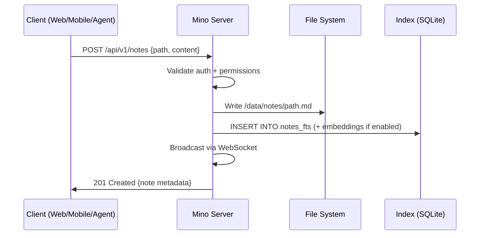

# Architecture

> Tech stack, three-layer model, deployment, hosting, Docker, and CI/CD pipeline.

[← Back to docs](./README.md)

---

## Technology Stack

### Recommended Stack

| Component | Technology | Rationale |
|-----------|------------|-----------|
| **Server Runtime** | **Bun** | 3x faster than Node.js for I/O, native TypeScript, built-in SQLite, single binary deploys, excellent DX |
| **Server Framework** | **Hono** | Ultra-lightweight (14KB), works everywhere (Bun/Node/Deno/Cloudflare), type-safe middleware, OpenAPI generation |
| **Web Framework** | **Next.js 15 (App Router)** | SSR for SEO (landing/docs), static export for Cloudflare Pages + bundled UI, massive ecosystem |
| **UI Components** | **shadcn/ui + Radix UI** | Accessible, composable, unstyled primitives. Already used in both prototypes. |
| **Styling** | **Tailwind CSS 4** | Utility-first, design token support, excellent with shadcn/ui |
| **Mobile** | **React Native + Expo** | Cross-platform iOS/Android, shared business logic with web, offline-first capabilities, OTA updates |
| **State Management** | **Zustand** | Minimal, unopinionated, works well with React and React Native |
| **Database (Index)** | **SQLite (via Bun built-in)** | Zero-config, embedded, incredibly fast for read-heavy workloads, portable, FTS5 for full-text search |
| **Data Storage** | **File system (markdown files)** | The core data IS the files. SQLite indexes them, but the source of truth is always the `.md` files on disk. |
| **Search** | **SQLite FTS5 + vector embeddings** | FTS5 for instant full-text search, optional embeddings (via `sqlite-vec`) for semantic search |
| **Auth** | **Hybrid (JWT + API Key + Google OAuth)** | JWT for sessions, API keys for machine access, Google OAuth for cross-device persistence on mino.ink |
| **Real-time Sync** | **WebSocket + Yjs (CRDTs)** | Conflict-free offline-first sync across devices |
| **AI/LLM** | **Model-agnostic (OpenAI, Anthropic, Google, local)** | User chooses their provider. Server proxies requests. |
| **Container Registry** | **GitHub Container Registry (ghcr.io)** | No pull rate limits, native GitHub Actions integration, free for public images |
| **CI/CD** | **GitHub Actions** | Builds Docker images, pushes to GHCR, deploys frontend to Cloudflare Pages |
| **Web Hosting** | **Cloudflare Pages** | Free, global CDN, static Next.js export, zero-config deploys |
| **Tunnel (optional)** | **Cloudflare Tunnel (cloudflared)** | Free, zero-port-exposure remote access to self-hosted servers |
| **Auto-updates** | **Watchtower** | Monitors GHCR for new image tags, auto-pulls and restarts containers |
| **Monorepo** | **pnpm workspaces + Turborepo** | Shared types, shared components, efficient builds |
| **Testing** | **Vitest + Playwright** | Fast unit tests, reliable E2E |
| **Docs** | **Mintlify or Starlight** | Beautiful API docs from OpenAPI spec |

### Why NOT Other Options?

| Rejected | Reason |
|----------|--------|
| **Go for server** | Great performance, but TypeScript everywhere (server → web → mobile) enables massive code sharing. Type-safe API contracts via shared packages. |
| **Flutter for mobile** | No code sharing with the web stack. React Native + Expo means shared components, hooks, and business logic between web and mobile. |
| **PostgreSQL** | Overkill for a note-taking app. SQLite is embeddable, zero-config, portable, and perfect for self-hosting. One file = your entire index. |
| **MongoDB/NoSQL** | Notes are files. The index database should be relational (tags, folders, links between notes). SQLite is ideal. |
| **Prisma ORM** | Too heavy for SQLite. Use `drizzle-orm` or raw `bun:sqlite` — faster, lighter, better SQLite support. |
| **Vanilla CSS** | Too much boilerplate for a large consistent design system. Tailwind + design tokens is the pragmatic choice. |
| **DockerHub** | Free tier has pull rate limits (100/6hr anonymous). GHCR has no limits and integrates natively with GitHub Actions. |
| **Vercel** | Great for Next.js but unnecessary — Cloudflare Pages is free and the frontend is just a static shell. |

---

## Deployment & Hosting Architecture

Connection policy:
- default: `relay` mode (managed relay connectivity)
- optional: `open-port` mode (direct public endpoint)
- relay deployment details: `docs/relay.md`

### Overview

```
┌─ mino.ink (Cloudflare Pages, FREE) ─────────────────────────┐
│  Static Next.js export — just a UI shell                     │
│  Auth: optional Google sign-in (persists linked servers)     │
│  OR: just paste server credentials (localStorage only)       │
│  OR: use the free-tier managed instance (limited)            │
└──────────────────────────┬───────────────────────────────────┘
                           │
            ┌──────────────┴──────────────┐
            │                             │
       Direct HTTPS              Cloudflare Tunnel (free)
       (port forwarded)          (zero ports exposed)
            │                             │
            └──────────────┬──────────────┘
                           ▼
┌─ User's Server (Docker, self-hosted) ───────────────────────┐
│  ghcr.io/tomszenessy/mino-server:main (default)              │
│                                                              │
│  ├─ Hono API server (:3000)                                  │
│  ├─ Built-in Web UI (same as mino.ink, served at /)          │
│  ├─ Agent Runtime (LLM, tools, plugins)                      │
│  ├─ SQLite index + file watcher                              │
│  ├─ Plugin host (install/load/update at runtime)             │
│  ├─ Sandbox (optional, for code execution / local AI tools)  │
│  └─ /data/ (notes, config, credentials, SQLite)              │
│                                                              │
│  Optional sidecars:                                          │
│  ├─ cloudflared (Cloudflare Tunnel for remote access)        │
│  └─ watchtower (auto-updates from GHCR)                      │
└──────────────────────────────────────────────────────────────┘
```

### Docker Compose (One-Paste for Portainer)

```yaml
services:
  mino:
    image: ghcr.io/tomszenessy/mino-server:${MINO_IMAGE_TAG:-main}
    volumes:
      - mino-data:/data
    ports:
      - "${MINO_PORT_BIND:-0.0.0.0}:${MINO_PORT:-3000}:3000"
    restart: unless-stopped
    # No environment variables needed — auto-bootstraps on first run

  # Optional: Cloudflare Tunnel for remote access (free, no open ports)
  cloudflared:
    image: cloudflare/cloudflared:latest
    entrypoint: ["/bin/sh"]
    command:
      - -c
      - |
        if [ -n "$${TUNNEL_TOKEN:-}" ]; then
          exec cloudflared tunnel --no-autoupdate run --token "$${TUNNEL_TOKEN}"
        fi
        exec tail -f /dev/null
    environment:
      - TUNNEL_TOKEN=${CF_TUNNEL_TOKEN:-}
    depends_on:
      - mino
    restart: unless-stopped

  # Optional: auto-updates from GHCR
  watchtower:
    image: containrrr/watchtower
    volumes:
      - /var/run/docker.sock:/var/run/docker.sock
    environment:
      - WATCHTOWER_CLEANUP=true
      - WATCHTOWER_POLL_INTERVAL=86400  # Check daily
    profiles: ["autoupdate"]

volumes:
  mino-data:
```

### Auto-Bootstrap (Zero Console Setup)

On first boot, the server detects `/data` is empty and bootstraps automatically:

1. Generates an **Admin API Key** (`mino_sk_xxxxxxxxxxxx`)
2. Generates a **Server ID** (unique UUID)
3. Creates a JWT signing secret
4. Writes default `config.json`
5. Creates `/data/notes/` folder structure
6. Initializes SQLite index (`mino.db`)
7. Writes credentials to `/data/credentials.json`
8. Starts the API + built-in UI immediately
9. Exposes `GET /api/v1/system/setup` with auth details + generated `/link` URLs

**No wizard. No terminal interaction. No environment variables needed.** User opens Portainer → deploys → opens `/api/v1/system/setup` → clicks generated `/link` URL → done.

### Server-Link Flow (Connecting mino.ink to a Server)

```
1. User deploys Docker → server auto-bootstraps
2. Server returns setup payload at /api/v1/system/setup
3. User opens one of the generated `/link?serverUrl=...&apiKey=...` URLs
4. Web client calls:
   a. POST {serverUrl}/api/v1/auth/verify
   b. POST {serverUrl}/api/v1/auth/link
5. Web client stores linked profile locally and redirects to `/workspace?profile=<id>`
6. All future API calls: Browser (mino.ink/test.mino.ink/local UI) → User's server directly
```

### Built-in Web UI

The server bundles the same web interface as mino.ink:

```
http://localhost:3000/           → Full web UI (identical to mino.ink)
http://localhost:3000/link       → Dedicated link handler
http://localhost:3000/workspace  → Workspace shell
http://localhost:3000/docs       → Docs explorer (`/docs` + `/docstart`)
http://localhost:3000/api/v1/system/setup → First-run setup payload
http://localhost:3000/api/v1/    → REST API
http://localhost:3000/ws         → WebSocket
```

**Build process:** GitHub Actions builds the Next.js frontend as a static export → the static files are embedded into the Docker image → Hono serves them at `/`.

This means:
- **Remote server:** User accesses via mino.ink → API calls go to their server
- **Local server:** User opens `http://localhost:3000` → full UI + API in one
- **Air-gapped:** Everything works offline with no external dependencies

### Free Tier (mino.ink Managed Instance)

Users who don't want to self-host get a **free limited instance** automatically:

| Feature | Free Tier | Self-Hosted |
|---------|-----------|-------------|
| **Storage** | Limited (e.g. 100MB / 1000 notes) | Unlimited (your disk) |
| **AI Agent** | Bring your own API key only | Install Whisper, OCR, local LLMs directly |
| **Transcription (Whisper)** | Via API key (OpenAI Whisper API) | Install locally on server (free, unlimited) |
| **OCR** | Via API key | Install Tesseract locally (free, unlimited) |
| **Local AI tools** | ❌ Not available | ✅ If server resources allow |
| **Plugins** | Core plugins only | All plugins + custom plugins |
| **Sandbox / code execution** | ❌ Not available | ✅ Full sandbox container |
| **Cloudflare Tunnel** | N/A (already hosted) | ✅ Optional sidecar |
| **Custom domain** | ❌ | ✅ Your own domain |

The server auto-detects available resources (CPU, RAM, GPU) and enables/disables features accordingly. For example, if a self-hosted server has a GPU, it can run Whisper locally for free transcription instead of requiring an API key.

### Cloudflare Tunnel (Free Remote Access)

For users whose server ports are closed (behind NAT, no port forwarding):

1. User creates a free Cloudflare Tunnel in their dashboard
2. Gets a tunnel token
3. Adds `CF_TUNNEL_TOKEN=xxx` to docker-compose environment
4. Redeploys stack (cloudflared auto-starts when token is present)
5. Server is accessible at `https://random-slug.cfargotunnel.com`
6. Zero ports exposed, traffic encrypted end-to-end

### CI/CD Pipeline (All Free)

```
GitHub repo (TomSzenessy/MinoAI)
  │
  ├─ On push to main / create version tag
  │   │
  │   ├─ GitHub Actions
  │   │   ├─ Lint + typecheck + test
  │   │   ├─ Build multi-arch Docker image (amd64 + arm64)
  │   │   ├─ Build Next.js static export → embed in Docker image
  │   │   └─ Push to ghcr.io/tomszenessy/mino-server:main + :latest + :vX.Y.Z
  │   │
  │   └─ Cloudflare Pages (auto-deploy)
  │       └─ Builds + deploys mino.ink frontend (static site)
  │
  └─ On user's server
      └─ Watchtower detects new ghcr.io tag → pulls + restarts → zero-downtime update
```

**Total cost: $0.** GHCR free for public images, GitHub Actions free for open-source, Cloudflare Pages free tier, Watchtower is just a container.

---

## Monorepo Structure

```
mino/
├── packages/
│   ├── shared/              # Shared types, utils, API contracts
│   │   ├── types/           # TypeScript types (Note, Folder, User, etc.)
│   │   ├── api-client/      # Type-safe API client (used by web + mobile)
│   │   ├── markdown/        # Markdown parsing/rendering utilities
│   │   └── design-tokens/   # CSS variables, Tailwind preset
│   └── ui/                  # Shared React components (works in web + RN)
│       ├── primitives/      # Button, Input, Card, etc.
│       └── features/        # Editor, Sidebar, NoteList, etc.
├── apps/
│   ├── server/              # Bun + Hono API server (+ bundled web UI)
│   ├── web/                 # Next.js web application (mino.ink + bundled UI)
│   └── mobile/              # React Native + Expo app
├── tools/
│   ├── mcp-server/          # MCP tool server for AI agents
│   └── cli/                 # CLI tool for server management
├── docker/                  # Dockerfiles, docker-compose.yml
│   ├── Dockerfile           # Multi-stage: build web → embed in server image
│   └── docker-compose.yml   # One-paste Portainer deployment
├── docs/                    # Documentation (this folder)
├── pnpm-workspace.yaml
├── turbo.json
├── README.md
└── MASTER_PLAN.md
```

---

## Three-Layer Architecture

```
┌─ Layer 1: INTERFACES ──────────────────────────────────────────┐
│  mino.ink    │ Built-in UI │ Mobile │ CLI │ MCP │ API Clients   │
│  (CF Pages)   (localhost)   (Expo)  (Bun) (SDK)  (curl/fetch)  │
└──────────────────────────────┬──────────────────────────────────┘
                               │  HTTPS + WebSocket
                               ▼
┌─ Layer 2: MINO SERVER ──────────────────────────────────────────┐
│                                                                  │
│  ┌─────────────┐  ┌──────────────┐  ┌──────────────────┐       │
│  │  HTTP Router │  │  WebSocket   │  │  Agent Runtime   │       │
│  │  (Hono)      │  │  (ws + Yjs)  │  │  (LLM + Tools)   │       │
│  └──────┬───────┘  └──────┬───────┘  └────────┬─────────┘       │
│         │                 │                    │                  │
│  ┌──────┴─────────────────┴────────────────────┴─────────┐      │
│  │                   SERVICE LAYER                         │      │
│  │  NoteService │ FolderService │ SearchService │ Auth     │      │
│  │  PluginService │ SandboxService │ ResourceDetector      │      │
│  └──────────────────────┬──────────────────────────────────┘      │
│                         │                                         │
│  ┌──────────────────────┴──────────────────────────────────┐      │
│  │                   DATA LAYER                             │      │
│  │    FileManager (R/W .md)  │  IndexDB (SQLite FTS+Vec)   │      │
│  └──────────────────────────────────────────────────────────┘      │
│                                                                  │
│  ┌──────────────────────────────────────────────────────────┐      │
│  │                   STATIC FILES                           │      │
│  │    Built-in Web UI (Next.js static export, served at /)  │      │
│  └──────────────────────────────────────────────────────────┘      │
│                                                                  │
└─ Layer 3: STORAGE ──────────────────────────────────────────────┘
   📁 /data/notes/**/*.md       (source of truth)
   📁 /data/assets/**           (images, attachments)
   📁 /data/plugins/**          (installed plugins)
   📁 /data/mino.db             (SQLite index)
   📁 /data/config.json         (server config)
   📁 /data/credentials.json    (auto-generated on first boot)
```

### Data Flow: How a Note Gets Created



### Multi-Server Architecture

Users can link multiple independent Mino servers to one Google account:

```
Server A (Personal)          Server B (Work)           Server C (Shared Team)
  └── ~/personal-notes/        └── ~/work-notes/          └── /shared/team-notes/
        ↓                            ↓                            ↓
  Docker on home NAS           Docker on work server      Docker on cloud VPS
        ↓                            ↓                            ↓
  ┌─── mino.ink (server picker — switch between linked servers) ──────────┐
  │  Sign in with Google → see all linked servers → select one → connected│
  └───────────────────────────────────────────────────────────────────────┘
```

---

## Data Storage & Indexing Strategy

### The Hybrid Approach

**Source of truth:** `.md` files on disk
**Index for speed:** SQLite database

```
┌─────────────────────────────────────────────────┐
│                FILE SYSTEM (source of truth)      │
│                                                   │
│  /data/notes/                                     │
│  ├── Projects/                                    │
│  │   ├── Alpha/                                   │
│  │   │   ├── architecture.md                      │
│  │   │   └── meeting-2026-02-11.md                │
│  │   └── Beta/                                    │
│  │       └── roadmap.md                           │
│  └── Daily/                                       │
│      ├── 2026-02-11.md                            │
│      └── 2026-02-10.md                            │
│                                                   │
│  /data/assets/                                    │
│  ├── images/                                      │
│  └── attachments/                                 │
│                                                   │
│  /data/plugins/                                   │
│  ├── web-search/                                  │
│  └── whisper-local/                               │
└──────────────────┬──────────────────────────────┘
                   │  File watcher + on-demand re-index
                   ▼
┌─────────────────────────────────────────────────┐
│               SQLite INDEX (derived, rebuildable)│
│                                                   │
│  notes table:                                     │
│    path, title, content_hash, tags, created,      │
│    modified, word_count, frontmatter_json          │
│                                                   │
│  notes_fts (FTS5 virtual table):                  │
│    title, content, tags                           │
│                                                   │
│  notes_vec (vector table, optional):              │
│    path, embedding (1536-dim float array)          │
│                                                   │
│  links table:                                     │
│    source_path, target_path                       │
│                                                   │
│  tags table:                                      │
│    tag, note_path                                  │
└─────────────────────────────────────────────────┘
```

### Why Files + SQLite (Not a Database)

| Concern | Files + SQLite | Pure Database |
|---------|---------------|---------------|
| **Portability** | Copy folder = done. `scp`, `rsync`, `git`. | Need `pg_dump`, migration scripts |
| **Agent compatibility** | Agents already understand files and paths | Agents need ORM abstractions |
| **Git integration** | Native. Your notes are already a git repo. | Need export/import |
| **External editing** | Any text editor works (VS Code, vim, etc.) | Only through the app |
| **Backup** | `tar -czf notes-backup.tar.gz /data/notes` | Database dump + restore |
| **Speed** | FTS5 searches millions of rows in <10ms | About the same |
| **Rebuild** | Delete `mino.db`. Server re-indexes on boot. | Data loss risk |

### Indexing Pipeline

On server start:
1. Walk the file tree
2. For each `.md` file: parse frontmatter, extract title/tags/links, compute content hash
3. Upsert into SQLite (skip if content hash unchanged)
4. Build FTS5 index
5. Optionally generate embeddings (async, background)

This takes <2 seconds for 10,000 notes on modern hardware.

### Embedding Strategy

For semantic search:

- **Model:** `text-embedding-3-small` (OpenAI) or local `all-MiniLM-L6-v2` (sentence-transformers)
- **Storage:** `sqlite-vec` extension for SQLite vector similarity search
- **Chunking:** Split notes at heading boundaries. Each heading section = one embedding.
- **Updates:** Re-embed only changed files (compare content hash)
- **Cost:** ~$0.02 per 1,000 notes (OpenAI), free for local models

---

## Offline-First & Sync Strategy

### CRDT-Based Sync (Yjs)

```
Device A (offline)     Mino Server     Device B (online)
      │                     │                  │
      │── Edit note ──►     │                  │
      │   (queued)          │                  │
      │                     │── Edit same ──►  │
      │                     │   note           │
      │── Come online ──►   │                  │
      │   Send Yjs update   │                  │
      │                     │── Merge ──►      │
      │                     │   (CRDT)         │
      │◄── Merged state ──  │── Merged state ──│
      │                     │                  │
```

### Sync Protocol

1. **Connect:** Client opens WebSocket to server
2. **Handshake:** Exchange vector clocks / state vectors
3. **Diff:** Server sends only the deltas since last sync
4. **Apply:** Client applies deltas locally (CRDT merge)
5. **Push:** Client sends its local deltas to server
6. **Continuous:** WebSocket stays open for real-time updates

### Conflict Resolution

CRDTs guarantee that all devices converge to the same state, regardless of the order edits arrive. No manual conflict resolution needed.

For the rare case of irreconcilable conflicts (e.g., one device deleted a note while another edited it), the "edit wins" policy is applied — deletions are soft-deletes that can be recovered.
