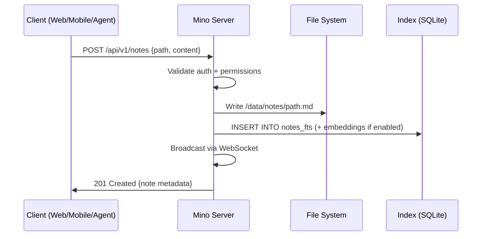

# Architecture

> Tech stack, three-layer model, data storage, and offline-first sync strategy.

[← Back to docs](./README.md)

---

## Technology Stack

### Recommended Stack

| Component | Technology | Rationale |
|-----------|------------|-----------|
| **Server Runtime** | **Bun** | 3x faster than Node.js for I/O, native TypeScript, built-in SQLite, single binary deploys, excellent DX |
| **Server Framework** | **Hono** | Ultra-lightweight (14KB), works everywhere (Bun/Node/Deno/Cloudflare), type-safe middleware, OpenAPI generation |
| **Web Framework** | **Next.js 15 (App Router)** | SSR for SEO (landing/docs), RSC for performance, massive ecosystem, Vercel deployment option |
| **UI Components** | **shadcn/ui + Radix UI** | Accessible, composable, unstyled primitives. Already used in both prototypes. |
| **Styling** | **Tailwind CSS 4** | Utility-first, design token support, excellent with shadcn/ui |
| **Mobile** | **React Native + Expo** | Cross-platform iOS/Android, shared business logic with web, offline-first capabilities, OTA updates |
| **State Management** | **Zustand** | Minimal, unopinionated, works well with React and React Native |
| **Database (Index)** | **SQLite (via Bun built-in)** | Zero-config, embedded, incredibly fast for read-heavy workloads, portable, FTS5 for full-text search |
| **Data Storage** | **File system (markdown files)** | The core data IS the files. SQLite indexes them, but the source of truth is always the `.md` files on disk. |
| **Search** | **SQLite FTS5 + vector embeddings** | FTS5 for instant full-text search, optional embeddings (via `sqlite-vec`) for semantic search |
| **Auth** | **JWT (self-hosted) + OAuth 2.0 (hosted)** | JWT for API access, Google OAuth for managed service |
| **Real-time Sync** | **WebSocket + Yjs (CRDTs)** | Conflict-free offline-first sync across devices |
| **AI/LLM** | **Model-agnostic (OpenAI, Anthropic, Google, local)** | User chooses their provider. Server proxies requests. |
| **Monorepo** | **pnpm workspaces + Turborepo** | Shared types, shared components, efficient builds |
| **Testing** | **Vitest + Playwright** | Fast unit tests, reliable E2E |
| **CI/CD** | **GitHub Actions** | Standard, free for open-source |
| **Docs** | **Mintlify or Starlight** | Beautiful API docs from OpenAPI spec |

### Why NOT Other Options?

| Rejected | Reason |
|----------|--------|
| **Go for server** | Great performance, but TypeScript everywhere (server → web → mobile) enables massive code sharing. Type-safe API contracts via shared packages. |
| **Flutter for mobile** | No code sharing with the web stack. React Native + Expo means shared components, hooks, and business logic between web and mobile. |
| **PostgreSQL** | Overkill for a note-taking app. SQLite is embeddable, zero-config, portable, and perfect for self-hosting. One file = your entire index. |
| **MongoDB/NoSQL** | Notes are files. The index database should be relational (tags, folders, links between notes). SQLite is ideal. |
| **Prisma ORM** | Too heavy for SQLite. Use `drizzle-orm` or raw `bun:sqlite` — faster, lighter, better SQLite support. |
| **Vanilla CSS** | Too much boilerplate for a large consistent design system. Tailwind + design tokens is the pragmatic choice. |

---

## Monorepo Structure

```
mino/
├── packages/
│   ├── shared/              # Shared types, utils, API contracts
│   │   ├── types/           # TypeScript types (Note, Folder, User, etc.)
│   │   ├── api-client/      # Type-safe API client (used by web + mobile)
│   │   ├── markdown/        # Markdown parsing/rendering utilities
│   │   └── design-tokens/   # CSS variables, Tailwind preset
│   └── ui/                  # Shared React components (works in web + RN)
│       ├── primitives/      # Button, Input, Card, etc.
│       └── features/        # Editor, Sidebar, NoteList, etc.
├── apps/
│   ├── server/              # Bun + Hono API server
│   ├── web/                 # Next.js web application
│   └── mobile/              # React Native + Expo app
├── tools/
│   ├── mcp-server/          # MCP tool server for AI agents
│   └── cli/                 # CLI tool for server management
├── docs/                    # Documentation site
├── docker/                  # Docker configs
├── pnpm-workspace.yaml
├── turbo.json
├── README.md
└── MASTER_PLAN.md           # This file
```

---

## Three-Layer Architecture

```
┌─ Layer 1: INTERFACES ──────────────────────────────────────┐
│  Web App │ Mobile App │ CLI │ MCP Tools │ Raw API Clients   │
│  (Next.js)  (Expo/RN)   (Bun)  (Agent SDK)  (curl/fetch)  │
└───────────────────────────┬─────────────────────────────────┘
                            │  HTTPS + WebSocket
                            ▼
┌─ Layer 2: MINO SERVER ──────────────────────────────────────┐
│                                                              │
│  ┌─────────────┐  ┌──────────────┐  ┌──────────────────┐   │
│  │  HTTP Router │  │  WebSocket   │  │  Agent Runtime   │   │
│  │  (Hono)      │  │  (ws + Yjs)  │  │  (LLM + Tools)   │   │
│  └──────┬───────┘  └──────┬───────┘  └────────┬─────────┘   │
│         │                 │                    │              │
│  ┌──────┴─────────────────┴────────────────────┴─────────┐  │
│  │                   SERVICE LAYER                         │  │
│  │  NoteService │ FolderService │ SearchService │ Auth     │  │
│  └──────────────────────┬──────────────────────────────────┘  │
│                         │                                     │
│  ┌──────────────────────┴──────────────────────────────────┐  │
│  │                   DATA LAYER                             │  │
│  │    FileManager (R/W .md)  │  IndexDB (SQLite FTS+Vec)   │  │
│  └──────────────────────────────────────────────────────────┘  │
│                                                              │
└─ Layer 3: STORAGE ───────────────────────────────────────────┘
   📁 /data/notes/**/*.md       (source of truth)
   📁 /data/assets/**           (images, attachments)
   📁 /data/mino.db             (SQLite index)
   📁 /data/config.json         (server config)
```

### Data Flow: How a Note Gets Created



### Multi-Server Architecture

Users can run multiple independent Mino servers:

```
Server A (Personal)          Server B (Work)           Server C (Shared Team)
  └── ~/personal-notes/        └── ~/work-notes/          └── /shared/team-notes/
        ↓                            ↓                            ↓
  https://home.mino.ink       https://work.mino.ink       https://team.mino.ink
        ↓                            ↓                            ↓
  ┌─── Mobile App (switch between servers in settings) ──────────────┐
  │  Server picker → select endpoint → enter API key → connected    │
  └──────────────────────────────────────────────────────────────────┘
```

---

## Data Storage & Indexing Strategy

### The Hybrid Approach

**Source of truth:** `.md` files on disk  
**Index for speed:** SQLite database

```
┌─────────────────────────────────────────────────┐
│                FILE SYSTEM (source of truth)      │
│                                                   │
│  /data/notes/                                     │
│  ├── Projects/                                    │
│  │   ├── Alpha/                                   │
│  │   │   ├── architecture.md                      │
│  │   │   └── meeting-2026-02-11.md                │
│  │   └── Beta/                                    │
│  │       └── roadmap.md                           │
│  └── Daily/                                       │
│      ├── 2026-02-11.md                            │
│      └── 2026-02-10.md                            │
│                                                   │
│  /data/assets/                                    │
│  ├── images/                                      │
│  └── attachments/                                 │
└──────────────────┬──────────────────────────────┘
                   │  File watcher + on-demand re-index
                   ▼
┌─────────────────────────────────────────────────┐
│               SQLite INDEX (derived, rebuildable)│
│                                                   │
│  notes table:                                     │
│    path, title, content_hash, tags, created,      │
│    modified, word_count, frontmatter_json          │
│                                                   │
│  notes_fts (FTS5 virtual table):                  │
│    title, content, tags                           │
│                                                   │
│  notes_vec (vector table, optional):              │
│    path, embedding (1536-dim float array)          │
│                                                   │
│  links table:                                     │
│    source_path, target_path                       │
│                                                   │
│  tags table:                                      │
│    tag, note_path                                  │
└─────────────────────────────────────────────────┘
```

### Why Files + SQLite (Not a Database)

| Concern | Files + SQLite | Pure Database |
|---------|---------------|---------------|
| **Portability** | Copy folder = done. `scp`, `rsync`, `git`. | Need `pg_dump`, migration scripts |
| **Agent compatibility** | Agents already understand files and paths | Agents need ORM abstractions |
| **Git integration** | Native. Your notes are already a git repo. | Need export/import |
| **External editing** | Any text editor works (VS Code, vim, etc.) | Only through the app |
| **Backup** | `tar -czf notes-backup.tar.gz /data/notes` | Database dump + restore |
| **Speed** | FTS5 searches millions of rows in <10ms | About the same |
| **Rebuild** | Delete `mino.db`. Server re-indexes on boot. | Data loss risk |

### Indexing Pipeline

On server start:
1. Walk the file tree
2. For each `.md` file: parse frontmatter, extract title/tags/links, compute content hash
3. Upsert into SQLite (skip if content hash unchanged)
4. Build FTS5 index
5. Optionally generate embeddings (async, background)

This takes <2 seconds for 10,000 notes on modern hardware.

### Embedding Strategy

For semantic search:

- **Model:** `text-embedding-3-small` (OpenAI) or local `all-MiniLM-L6-v2` (sentence-transformers)
- **Storage:** `sqlite-vec` extension for SQLite vector similarity search
- **Chunking:** Split notes at heading boundaries. Each heading section = one embedding.
- **Updates:** Re-embed only changed files (compare content hash)
- **Cost:** ~$0.02 per 1,000 notes (OpenAI), free for local models

---

## Offline-First & Sync Strategy

### CRDT-Based Sync (Yjs)

```
Device A (offline)     Mino Server     Device B (online)
      │                     │                  │
      │── Edit note ──►     │                  │
      │   (queued)          │                  │
      │                     │── Edit same ──►  │
      │                     │   note           │
      │── Come online ──►   │                  │
      │   Send Yjs update   │                  │
      │                     │── Merge ──►      │
      │                     │   (CRDT)         │
      │◄── Merged state ──  │── Merged state ──│
      │                     │                  │
```

### Sync Protocol

1. **Connect:** Client opens WebSocket to server
2. **Handshake:** Exchange vector clocks / state vectors
3. **Diff:** Server sends only the deltas since last sync
4. **Apply:** Client applies deltas locally (CRDT merge)
5. **Push:** Client sends its local deltas to server
6. **Continuous:** WebSocket stays open for real-time updates

### Conflict Resolution

CRDTs guarantee that all devices converge to the same state, regardless of the order edits arrive. No manual conflict resolution needed.

For the rare case of irreconcilable conflicts (e.g., one device deleted a note while another edited it), the "edit wins" policy is applied — deletions are soft-deletes that can be recovered.
