# Mino Implementation Architecture

> Comprehensive implementation architecture for the Mino knowledge platform.
> This document guides development through all phases with detailed technical specifications.

---

## Table of Contents

1. [Project Structure](#1-project-structure)
2. [Server Architecture](#2-server-architecture)
3. [Frontend Architecture](#3-frontend-architecture)
4. [Agent Architecture](#4-agent-architecture)
5. [Deployment Architecture](#5-deployment-architecture)
6. [Configuration System](#6-configuration-system)
7. [Security Model](#7-security-model)
8. [Testing Strategy](#8-testing-strategy)

---

## 1. Project Structure

### 1.1 Monorepo Layout

```
mino/
├── packages/
│   ├── shared/                    # @mino-ink/shared
│   │   ├── src/
│   │   │   ├── types/             # TypeScript interfaces
│   │   │   │   ├── api.ts         # API request/response types
│   │   │   │   ├── auth.ts        # Auth-related types
│   │   │   │   ├── config.ts      # Server configuration types
│   │   │   │   ├── note.ts        # Note and folder types
│   │   │   │   └── system.ts      # System and capability types
│   │   │   ├── utils/             # Shared utilities
│   │   │   │   ├── markdown.ts    # Markdown parsing utilities
│   │   │   │   ├── paths.ts       # Path normalization utilities
│   │   │   │   └── crypto.ts      # Hashing and crypto utilities
│   │   │   └── index.ts           # Public exports
│   │   ├── package.json
│   │   └── tsconfig.json
│   │
│   ├── api-client/                # @mino-ink/api-client (future)
│   │   ├── src/
│   │   │   ├── client.ts          # Type-safe API client
│   │   │   ├── fetcher.ts         # HTTP fetch wrapper
│   │   │   └── websocket.ts       # WebSocket client
│   │   └── package.json
│   │
│   └── design-tokens/             # @mino-ink/design-tokens (future)
│       ├── src/
│       │   ├── tokens.css         # CSS custom properties
│       │   ├── tailwind.preset.ts # Tailwind configuration
│       │   └── index.ts           # Token exports
│       └── package.json
│
├── apps/
│   ├── server/                    # Mino Server (Bun + Hono)
│   │   ├── src/
│   │   │   ├── index.ts           # Entry point
│   │   │   ├── server.ts          # Hono app factory
│   │   │   ├── types.ts           # App context types
│   │   │   ├── bootstrap/         # First-run initialization
│   │   │   │   ├── index.ts       # Bootstrap orchestrator
│   │   │   │   ├── config.ts      # Default config generation
│   │   │   │   └── credentials.ts # API key and secret generation
│   │   │   ├── config/            # Configuration loading
│   │   │   │   ├── index.ts       # Config loader
│   │   │   │   ├── schema.ts      # Zod validation schema
│   │   │   │   └── defaults.ts    # Default values
│   │   │   ├── middleware/        # Hono middleware
│   │   │   │   ├── auth.ts        # API key/JWT authentication
│   │   │   │   ├── cors.ts        # CORS handling
│   │   │   │   ├── error-handler.ts # Global error handling
│   │   │   │   ├── rate-limit.ts  # Rate limiting
│   │   │   │   └── request-logger.ts # Request logging
│   │   │   ├── routes/            # API route handlers
│   │   │   │   ├── health.ts      # Health check endpoints
│   │   │   │   ├── setup.ts       # First-run setup endpoint
│   │   │   │   ├── system.ts      # System info endpoints
│   │   │   │   ├── auth.ts        # Authentication endpoints
│   │   │   │   ├── notes.ts       # Note CRUD endpoints
│   │   │   │   ├── folders.ts     # Folder management
│   │   │   │   ├── search.ts      # Search endpoints
│   │   │   │   ├── plugins.ts     # Plugin management
│   │   │   │   ├── agent.ts       # AI agent chat
│   │   │   │   └── channels.ts    # Channel webhooks
│   │   │   ├── services/          # Business logic layer
│   │   │   │   ├── file-manager.ts    # File system operations
│   │   │   │   ├── note-service.ts    # Note business logic
│   │   │   │   ├── agent-service.ts   # AI agent logic
│   │   │   │   ├── plugin-service.ts  # Plugin management
│   │   │   │   ├── channel-service.ts # Channel management
│   │   │   │   └── relay-connector.ts # Relay connection
│   │   │   ├── plugins/           # Plugin system
│   │   │   │   ├── types.ts       # Plugin type definitions
│   │   │   │   ├── registry.ts    # Plugin registry
│   │   │   │   └── builtin/       # Bundled plugins
│   │   │   │       ├── web-search/
│   │   │   │       ├── youtube-transcript/
│   │   │   │       ├── telegram-bot/
│   │   │   │       ├── whatsapp-bot/
│   │   │   │       └── obsidian-import/
│   │   │   ├── channels/          # Channel providers
│   │   │   │   ├── types.ts       # Channel types
│   │   │   │   ├── registry.ts    # Channel registry
│   │   │   │   └── providers/
│   │   │   │       ├── telegram.ts
│   │   │   │       └── whatsapp.ts
│   │   │   └── utils/             # Server utilities
│   │   │       ├── logger.ts      # Logging utility
│   │   │       ├── paths.ts       # Path utilities
│   │   │       ├── markdown.ts    # Markdown parsing
│   │   │       ├── crypto.ts      # Crypto utilities
│   │   │       └── connect-links.ts # Connect URL generation
│   │   ├── tests/                 # Server tests
│   │   ├── package.json
│   │   └── tsconfig.json
│   │
│   ├── web/                       # Mino Web (Next.js 15)
│   │   ├── app/                   # Next.js App Router
│   │   │   ├── layout.tsx         # Root layout
│   │   │   ├── page.tsx           # Landing page
│   │   │   ├── globals.css        # Global styles
│   │   │   ├── link/              # Server link handler
│   │   │   │   └── page.tsx
│   │   │   ├── workspace/         # Main workspace
│   │   │   │   └── page.tsx
│   │   │   ├── settings/          # Settings pages
│   │   │   │   ├── page.tsx
│   │   │   │   └── plugins/
│   │   │   │       └── page.tsx
│   │   │   └── docs/              # Documentation
│   │   │       ├── page.tsx
│   │   │       └── [...slug]/
│   │   │           └── page.tsx
│   │   ├── components/            # React components
│   │   │   ├── app-providers.tsx  # Context providers
│   │   │   ├── navbar.tsx         # Navigation bar
│   │   │   ├── brand-logo.tsx     # Logo component
│   │   │   ├── workspace/         # Workspace components
│   │   │   │   ├── sidebar.tsx
│   │   │   │   ├── note-list.tsx
│   │   │   │   ├── note-editor.tsx
│   │   │   │   ├── command-palette.tsx
│   │   │   │   └── agent-chat-panel.tsx
│   │   │   └── ui/                # shadcn/ui components
│   │   ├── lib/                   # Client-side utilities
│   │   │   ├── api.ts             # API client
│   │   │   ├── config.ts          # App configuration
│   │   │   ├── storage.ts         # LocalStorage management
│   │   │   ├── settings.ts        # Settings management
│   │   │   ├── theme.ts           # Theme utilities
│   │   │   ├── i18n.ts            # Internationalization
│   │   │   ├── plugins.ts         # Plugin utilities
│   │   │   ├── relay.ts           # Relay utilities
│   │   │   └── linking.ts         # Server linking
│   │   ├── messages/              # i18n translations
│   │   │   ├── en.json
│   │   │   ├── de.json
│   │   │   └── es.json
│   │   ├── public/                # Static assets
│   │   ├── tests/                 # Web tests
│   │   ├── package.json
│   │   ├── next.config.ts
│   │   ├── tailwind.config.ts
│   │   └── tsconfig.json
│   │
│   ├── relay/                     # Mino Relay (Bun + Hono)
│   │   ├── src/
│   │   │   └── index.ts           # Relay server
│   │   ├── tests/
│   │   ├── package.json
│   │   └── tsconfig.json
│   │
│   └── mobile/                    # Mino Mobile (future - Expo)
│       ├── app/                   # Expo Router
│       ├── components/            # React Native components
│       ├── lib/                   # Mobile utilities
│       ├── package.json
│       └── app.json
│
├── tools/
│   ├── mcp-server/                # MCP server for AI agents
│   │   ├── src/
│   │   │   └── index.ts
│   │   └── package.json
│   │
│   └── cli/                       # CLI tool (future)
│       ├── src/
│       │   └── index.ts
│       └── package.json
│
├── docker/
│   ├── Dockerfile                 # Multi-stage server build
│   ├── Relay.Dockerfile           # Relay server build
│   ├── docker-compose.yml         # Server stack
│   └── relay-docker-compose.yml   # Relay stack
│
├── docs/                          # Documentation
│   ├── README.md
│   ├── architecture.md
│   ├── server.md
│   ├── frontend.md
│   ├── ai-agent.md
│   ├── security.md
│   ├── design-system.md
│   ├── roadmap.md
│   └── relay.md
│
├── docs-site/                     # Public docs site content
│   ├── introduction.md
│   ├── guides/
│   ├── deployment/
│   ├── reference/
│   └── api/
│
├── plans/                         # Architecture plans
│   └── implementation-architecture.md
│
├── .github/
│   └── workflows/
│       └── ci.yml                 # CI/CD pipeline
│
├── pnpm-workspace.yaml
├── package.json
├── pnpm-lock.yaml
├── tsconfig.base.json
├── turbo.json                     # Turborepo config (future)
├── MASTER_PLAN.md
└── README.md
```

### 1.2 Package Dependencies

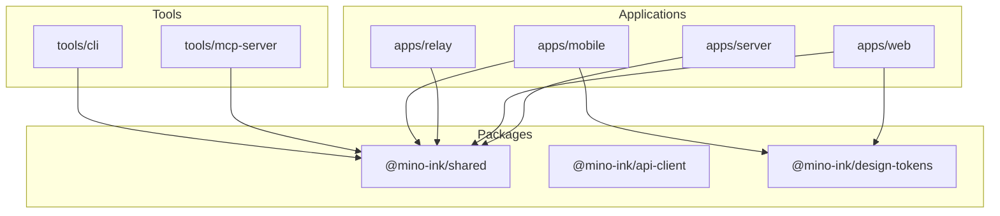

### 1.3 Shared Types Overview

The `@mino-ink/shared` package provides type definitions used across all applications:

| Type File                                          | Purpose        | Key Types                                                      |
| -------------------------------------------------- | -------------- | -------------------------------------------------------------- |
| [`api.ts`](packages/shared/src/types/api.ts)       | API contracts  | `ApiResponse`, `ApiError`, `PaginatedResponse`, `SearchResult` |
| [`auth.ts`](packages/shared/src/types/auth.ts)     | Authentication | `Credentials`, auth-related types                              |
| [`config.ts`](packages/shared/src/types/config.ts) | Server config  | `ServerConfig`, `AgentConfig`, `ConnectionConfig`              |
| [`note.ts`](packages/shared/src/types/note.ts)     | Note model     | `Note`, `NoteMetadata`, `FolderNode`, `FolderTree`             |
| [`system.ts`](packages/shared/src/types/system.ts) | System info    | `SystemCapabilities`, resource types                           |

---

## 2. Server Architecture

### 2.1 Hono Application Factory

The server uses a factory pattern for testability and dependency injection:

```typescript
// apps/server/src/server.ts
export interface AppDependencies {
	config: ServerConfig;
	credentials: Credentials;
	dataDir: string;
	version: string;
	webDistDir?: string | null;
}

export function createApp(deps: AppDependencies): Hono<AppContext> {
	const app = new Hono<AppContext>();

	// 1. Error handling (first, catches all errors)
	app.onError(handleAppError);

	// 2. Inject dependencies into context
	app.use('*', contextInjector(deps));

	// 3. CORS middleware
	app.use('*', corsMiddleware);

	// 4. Request logging
	app.use('*', requestLogger);

	// 5. Rate limiting
	app.use('/api/*', apiRateLimitMiddleware);

	// 6. Static file serving (built-in UI)
	app.use('/*', staticFileHandler);

	// 7. API routes
	app.route('/api/v1', apiRoutes);

	return app;
}
```

### 2.2 Middleware Stack

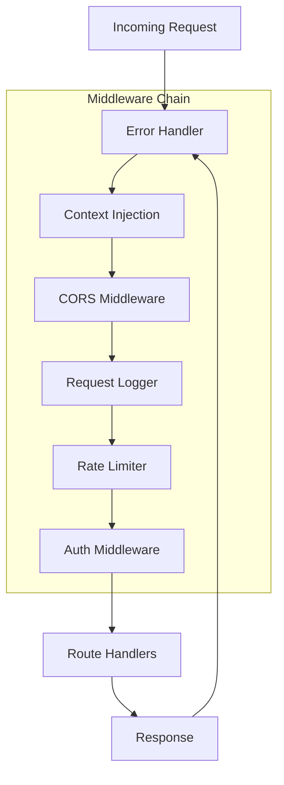

#### Middleware Responsibilities

| Middleware            | Purpose               | Key Features                                  |
| --------------------- | --------------------- | --------------------------------------------- |
| **Error Handler**     | Global error catching | Converts errors to `ApiError` format          |
| **Context Injection** | Dependency injection  | Makes config, credentials available to routes |
| **CORS**              | Cross-origin handling | Dynamic origin validation, preflight handling |
| **Request Logger**    | Request logging       | Structured logging with timing                |
| **Rate Limiter**      | Request throttling    | Per-IP and per-API-key limits                 |
| **Auth**              | Authentication        | API key validation, JWT verification          |

### 2.3 Route Organization

```typescript
// apps/server/src/routes/*.ts

// Health routes (no auth required)
GET  /api/v1/health           // Basic health check
GET  /api/v1/health/detailed  // Detailed system status

// Setup routes (no auth required, first-run only)
GET  /api/v1/system/setup     // Get setup credentials

// System routes (auth required)
GET  /api/v1/system/info      // Server info
GET  /api/v1/system/capabilities // Resource detection

// Auth routes
POST /api/v1/auth/verify      // Verify API key
POST /api/v1/auth/link        // Link server to account

// Note routes (auth required)
GET    /api/v1/notes          // List notes
GET    /api/v1/notes/:path    // Get note
POST   /api/v1/notes          // Create note
PUT    /api/v1/notes/:path    // Update note
DELETE /api/v1/notes/:path    // Delete note

// Folder routes (auth required)
GET    /api/v1/tree           // Get folder tree
POST   /api/v1/folders        // Create folder
DELETE /api/v1/folders/:path  // Delete folder

// Search routes (auth required)
GET    /api/v1/search         // Full-text search

// Plugin routes (auth required)
GET    /api/v1/plugins        // List installed plugins
GET    /api/v1/plugins/marketplace // Browse plugins
POST   /api/v1/plugins/install // Install plugin
DELETE /api/v1/plugins/:name  // Uninstall plugin

// Agent routes (auth required)
POST   /api/v1/agent/chat     // Chat with agent
GET    /api/v1/agent/status   // Agent status

// Channel routes (auth required)
GET    /api/v1/channels       // List channels
POST   /api/v1/channels       // Create channel
DELETE /api/v1/channels/:id   // Delete channel

// Webhook routes (no auth, secret-based)
POST   /api/v1/webhooks/telegram/:id // Telegram webhook
POST   /api/v1/webhooks/whatsapp/:id // WhatsApp webhook
```

### 2.4 Service Layer Design

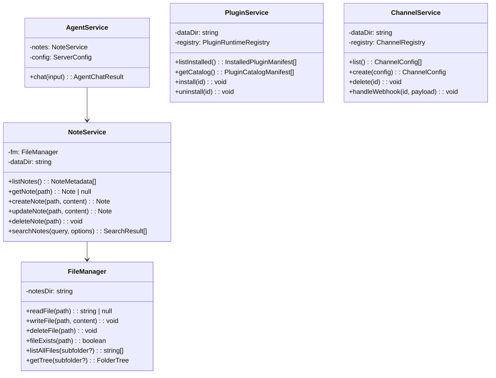

### 2.5 Data Layer

#### File System Structure

```
/data/
├── notes/                    # Markdown files (source of truth)
│   ├── Projects/
│   │   ├── Alpha/
│   │   │   └── readme.md
│   │   └── Beta/
│   │       └── notes.md
│   ├── Daily/
│   │   └── 2026-02-13.md
│   └── Personal/
│       └── ideas.md
├── assets/                   # Images and attachments
├── plugins/                  # Installed plugins
│   └── web-search/
│       └── plugin.json
├── mino.db                   # SQLite index (Phase 2)
├── config.json               # Server configuration
└── credentials.json          # Auto-generated credentials
```

#### SQLite Index Schema (Phase 2)

```sql
-- Notes metadata table
CREATE TABLE notes (
  path TEXT PRIMARY KEY,
  title TEXT NOT NULL,
  content_hash TEXT NOT NULL,
  word_count INTEGER,
  created_at TEXT,
  updated_at TEXT,
  frontmatter_json TEXT
);

-- Full-text search virtual table
CREATE VIRTUAL TABLE notes_fts USING fts5(
  path,
  title,
  content,
  tags,
  content='notes',
  content_rowid='rowid'
);

-- Tags table
CREATE TABLE tags (
  tag TEXT,
  note_path TEXT,
  PRIMARY KEY (tag, note_path)
);

-- Links table
CREATE TABLE links (
  source_path TEXT,
  target_path TEXT,
  PRIMARY KEY (source_path, target_path)
);

-- Vector embeddings (optional, Phase 7)
CREATE VIRTUAL TABLE notes_vec USING vec0(
  path TEXT PRIMARY KEY,
  embedding FLOAT[1536]
);
```

---

## 3. Frontend Architecture

### 3.1 Next.js App Router Structure

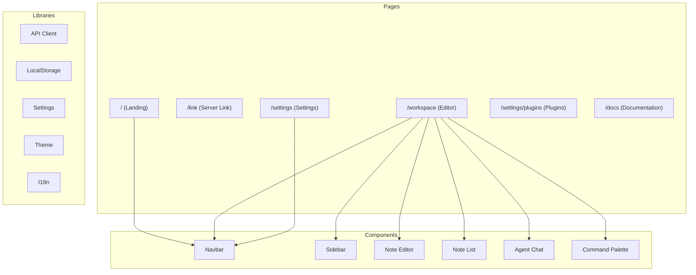

### 3.2 Component Hierarchy

```
AppProviders (context providers)
├── ThemeProvider
├── I18nProvider
└── QueryClientProvider (future)
    └── RootLayout
        ├── Navbar
        │   ├── BrandLogo
        │   ├── NavLinks
        │   └── ServerSwitcher
        └── Page Content
            ├── LandingPage
            │   ├── HeroSection
            │   ├── FeaturesGrid
            │   └── CTASection
            ├── LinkPage
            │   ├── LinkStatusCard
            │   └── ManualLinkForm
            ├── WorkspacePage
            │   ├── Sidebar
            │   │   ├── FolderTree
            │   │   └── StorageIndicator
            │   ├── NoteList
            │   │   ├── NoteListItem
            │   │   └── SearchInput
            │   ├── NoteEditor
            │   │   ├── TitleField
            │   │   ├── MarkdownEditor
            │   │   └── StatusBar
            │   ├── AgentChatPanel
            │   │   ├── ChatMessages
            │   │   └── ChatInput
            │   └── CommandPalette
            └── SettingsPage
                ├── SettingsLayout
                ├── AgentSettings
                ├── ServerSettings
                └── PluginSettings
```

### 3.3 State Management

#### Local Storage Schema

```typescript
// apps/web/lib/storage.ts

interface StoredProfile {
	id: string;
	name: string;
	serverUrl: string;
	apiKey: string;
	relayUrl?: string;
	relayCode?: string;
	createdAt: string;
	lastUsedAt: string;
}

interface StorageSchema {
	profiles: StoredProfile[];
	activeProfileId: string | null;
	theme: 'dark' | 'light' | 'system';
	preferences: {
		sidebarCollapsed: boolean;
		editorFontSize: number;
		commandPaletteRecent: string[];
	};
}
```

#### State Architecture

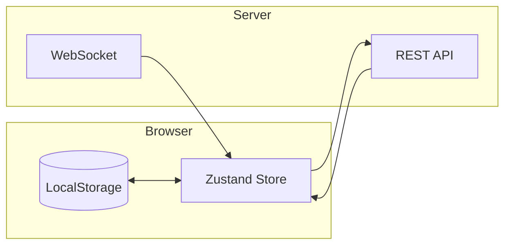

### 3.4 API Client Design

```typescript
// apps/web/lib/api.ts

export class MinoApiClient {
	private baseUrl: string;
	private apiKey: string;

	constructor(baseUrl: string, apiKey: string) {
		this.baseUrl = baseUrl;
		this.apiKey = apiKey;
	}

	// Health
	async getHealth(): Promise<HealthPayload>;

	// Auth
	async verifyKey(): Promise<VerifyPayload>;
	async linkServer(): Promise<LinkPayload>;

	// Notes
	async listNotes(): Promise<NoteSummary[]>;
	async getNote(path: string): Promise<Note>;
	async createNote(path: string, content: string): Promise<Note>;
	async updateNote(path: string, content: string): Promise<Note>;
	async deleteNote(path: string): Promise<void>;

	// Search
	async searchNotes(
		query: string,
		options?: SearchOptions
	): Promise<SearchResult[]>;

	// Tree
	async getTree(): Promise<FolderTree>;

	// Plugins
	async listPlugins(): Promise<PluginManifest[]>;
	async getPluginCatalog(): Promise<PluginCatalogItem[]>;
	async installPlugin(id: string): Promise<void>;
	async uninstallPlugin(id: string): Promise<void>;

	// Agent
	async agentChat(
		message: string,
		options?: ChatOptions
	): Promise<AgentChatPayload>;
	async getAgentStatus(): Promise<AgentStatusPayload>;

	// Channels
	async listChannels(): Promise<ChannelConfig[]>;
	async createChannel(config: ChannelConfigInput): Promise<ChannelConfig>;
	async deleteChannel(id: string): Promise<void>;
}
```

### 3.5 Design System Integration

The frontend uses the Mino design tokens defined in [`docs/design-system.md`](docs/design-system.md):

```css
/* apps/web/app/globals.css */

:root {
	/* Background Scale (Dark Mode) */
	--mino-bg-base: #121212;
	--mino-bg-surface: #1e1e1e;
	--mino-bg-elevated: #2a2a2a;
	--mino-bg-hover: #353535;
	--mino-bg-active: #404040;

	/* Purple Accent Scale */
	--mino-purple-400: #bb86fc; /* Brand Primary */
	--mino-purple-500: #a96ef5;
	--mino-purple-600: #9b5de5;
	--mino-purple-700: #7e3fcc;

	/* Glass Effects */
	--mino-glass-bg: rgba(255, 255, 255, 0.04);
	--mino-glass-border: rgba(187, 134, 252, 0.08);
	--mino-glass-blur: blur(16px);

	/* Glow Effects */
	--mino-glow: 0 0 30px -5px rgba(187, 134, 252, 0.35);
}
```

---

## 4. Agent Architecture

### 4.1 Tool System Design

```mermaid
flowchart TB
    subgraph Agent Runtime
        llm[LLM Provider]
        toolLayer[Tool Layer]
        context[Context Strategy]
    end

    subgraph Core Tools
        search[mino.search]
        read[mino.read]
        write[mino.write]
        edit[mino.edit]
        move[mino.move]
        delete[mino.delete]
        tree[mino.tree]
        tags[mino.tags]
        recent[mino.recent]
        links[mino.links]
    end

    subgraph Plugin Tools
        webSearch[web.search]
        youtube[youtube.transcript]
        whisper[whisper.transcribe]
        ocr[ocr.extract]
        email[email.fetch]
    end

    llm --> toolLayer
    toolLayer --> Core Tools
    toolLayer --> Plugin Tools
    context --> llm
```

### 4.2 Tool Definitions

```typescript
// Core tools available to the agent

const CORE_TOOLS = {
	mino_search: {
		description:
			'Search notes by query. Returns snippets, not full content.',
		parameters: {
			query: { type: 'string', required: true },
			limit: { type: 'number', default: 10 },
			folder: { type: 'string' }
		}
	},

	mino_read: {
		description: 'Read a specific note by path.',
		parameters: {
			path: { type: 'string', required: true }
		}
	},

	mino_write: {
		description: 'Create or replace a note.',
		parameters: {
			path: { type: 'string', required: true },
			content: { type: 'string', required: true }
		}
	},

	mino_edit: {
		description: 'Search-and-replace in a note. Preferred for small edits.',
		parameters: {
			path: { type: 'string', required: true },
			oldText: { type: 'string', required: true },
			newText: { type: 'string', required: true }
		}
	},

	mino_move: {
		description: 'Move or rename a note.',
		parameters: {
			oldPath: { type: 'string', required: true },
			newPath: { type: 'string', required: true }
		}
	},

	mino_tree: {
		description: 'Get folder structure. Use folder path to drill down.',
		parameters: {
			folder: { type: 'string' }
		}
	}
};
```

### 4.3 Context Strategy

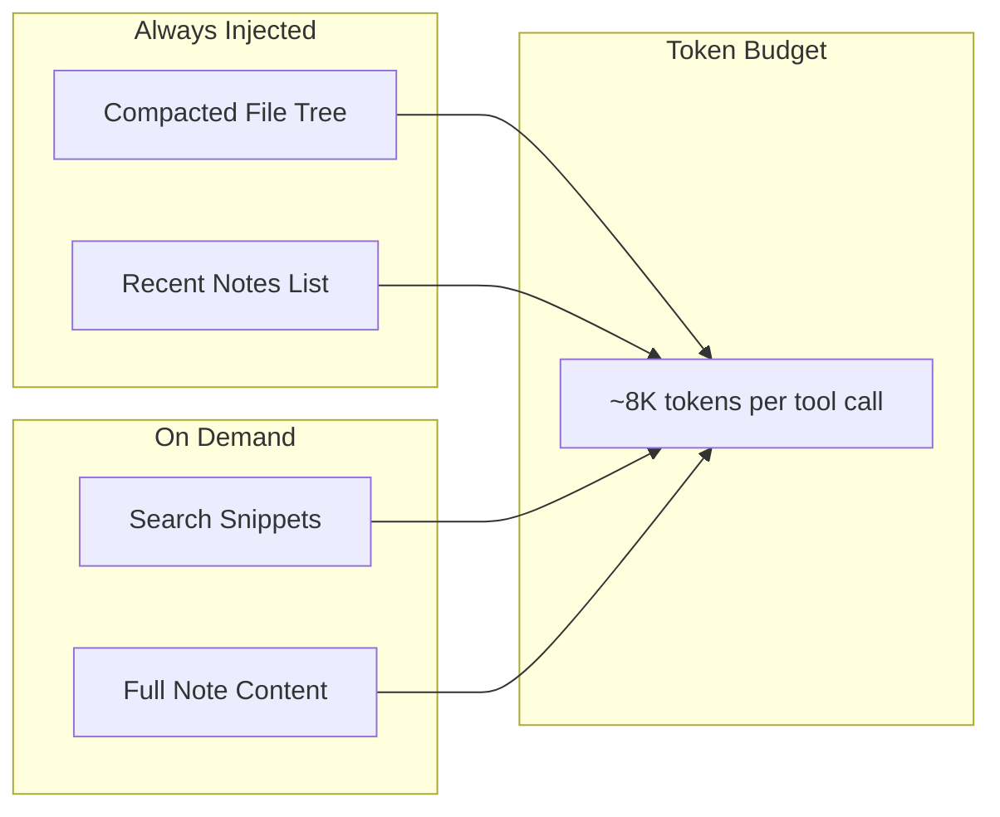

#### Context Size Optimization

| Strategy                     | Description                        | Token Savings       |
| ---------------------------- | ---------------------------------- | ------------------- |
| **Compact file tree**        | Folder names + file counts only    | ~80% vs full tree   |
| **Snippet search**           | 200-char snippets around matches   | ~90% vs full files  |
| **Search-and-replace edits** | `mino.edit()` instead of full file | ~95% vs full file   |
| **Embeddings pre-filter**    | Vector similarity before reading   | ~99% vs reading all |

### 4.4 Permission Model

```typescript
// apps/server/src/services/agent-service.ts

interface AgentPermissions {
	read: boolean; // Read any note (default: true)
	search: boolean; // Search across notes (default: true)
	write: boolean; // Create new notes (default: true)
	edit: boolean; // Modify existing notes (default: true)
	move: boolean; // Move/rename notes (default: true)
	delete: boolean; // Delete notes (default: false)
	organize: boolean; // Batch operations (default: false)
	plugins: boolean; // Use installed plugins (default: true)
	sandbox: boolean; // Execute code (default: false)
	scope: string[]; // Folder restrictions (default: all)
}

const DEFAULT_PERMISSIONS: AgentPermissions = {
	read: true,
	search: true,
	write: true,
	edit: true,
	move: true,
	delete: false,
	organize: false,
	plugins: true,
	sandbox: false,
	scope: []
};
```

### 4.5 Multi-Channel Support

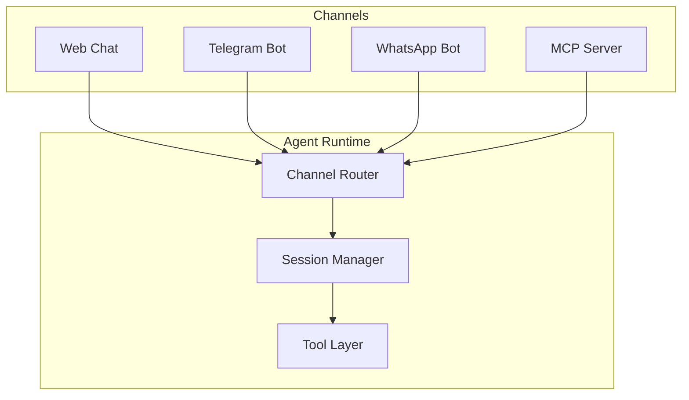

---

## 5. Deployment Architecture

### 5.1 Docker Configuration

```dockerfile
# docker/Dockerfile - Multi-stage build

# Stage 1: Dependencies
FROM oven/bun:1 AS deps
WORKDIR /app
COPY package.json pnpm-workspace.yaml .npmrc ./
COPY packages/shared/package.json ./packages/shared/
COPY apps/server/package.json ./apps/server/
COPY apps/web/package.json ./apps/web/
RUN bun install --frozen-lockfile || bun install

# Stage 2: Build
FROM oven/bun:1 AS build
WORKDIR /app
COPY --from=deps /app/node_modules ./node_modules
COPY --from=deps /app/packages/shared/node_modules ./packages/shared/node_modules
COPY --from=deps /app/apps/server/node_modules ./apps/server/node_modules
COPY --from=deps /app/apps/web/node_modules ./apps/web/node_modules

ARG BUILD_COMMIT=dev
RUN echo "Building from commit: ${BUILD_COMMIT}"

COPY tsconfig.base.json ./
COPY packages/shared/ ./packages/shared/
COPY apps/server/ ./apps/server/
COPY apps/web/ ./apps/web/
COPY docs/ ./docs/
COPY docs-site/ ./docs-site/

# Build shared package first
RUN cd packages/shared && bun run build

# Build static web app
RUN cd apps/web && MINO_WEB_OUTPUT=export bun run build

# Build server
RUN cd apps/server && bun run build

# Stage 3: Runtime
FROM oven/bun:1-slim AS runtime
LABEL org.opencontainers.image.title="Mino Server"
LABEL org.opencontainers.image.source="https://github.com/TomSzenessy/MinoAI"

RUN apt-get update && apt-get install -y --no-install-recommends ca-certificates && rm -rf /var/lib/apt/lists/*

WORKDIR /app

# Copy only what's needed to run
COPY --from=deps /app/node_modules ./node_modules
COPY --from=deps /app/packages/shared/node_modules ./packages/shared/node_modules
COPY --from=deps /app/apps/server/node_modules ./apps/server/node_modules
COPY --from=build /app/packages/shared/dist ./packages/shared/dist
COPY --from=build /app/apps/server/src ./apps/server/src
COPY --from=build /app/apps/web/out ./apps/web/out
COPY packages/shared/package.json ./packages/shared/
COPY apps/server/package.json ./apps/server/

# Create data directory
RUN mkdir -p /data/notes /data/plugins

EXPOSE 3000

HEALTHCHECK --interval=30s --timeout=5s --start-period=10s --retries=3 \
  CMD ["bun", "-e", "fetch('http://127.0.0.1:3000/api/v1/health').then((r)=>process.exit(r.ok?0:1)).catch(()=>process.exit(1))"]

CMD ["bun", "run", "apps/server/src/index.ts"]
```

### 5.2 Docker Compose Stack

```yaml
# docker/docker-compose.yml

services:
    mino:
        image: ghcr.io/tomszenessy/mino-server:${MINO_IMAGE_TAG:-main}
        volumes:
            - mino-data:/data
        ports:
            - '${MINO_PORT_BIND:-0.0.0.0}:${MINO_PORT:-3000}:3000'
        environment:
            - MINO_CONNECTION_MODE=${MINO_CONNECTION_MODE:-relay}
            - MINO_RELAY_URL=${MINO_RELAY_URL:-https://relay.mino.ink}
        restart: unless-stopped

    # Optional: Cloudflare Tunnel
    cloudflared:
        image: cloudflare/cloudflared:latest
        entrypoint: ['/bin/sh']
        command:
            - -c
            - |
                if [ -n "$${TUNNEL_TOKEN:-}" ]; then
                  exec cloudflared tunnel --no-autoupdate run --token "$${TUNNEL_TOKEN}"
                fi
                exec tail -f /dev/null
        environment:
            - TUNNEL_TOKEN=${CF_TUNNEL_TOKEN:-}
        depends_on:
            - mino
        restart: unless-stopped
        profiles:
            - tunnel

    # Optional: Auto-updates
    watchtower:
        image: containrrr/watchtower
        volumes:
            - /var/run/docker.sock:/var/run/docker.sock
        environment:
            - WATCHTOWER_CLEANUP=true
            - WATCHTOWER_POLL_INTERVAL=86400
        profiles:
            - autoupdate

volumes:
    mino-data:
```

### 5.3 CI/CD Pipeline

```yaml
# .github/workflows/ci.yml

name: CI/CD

on:
    push:
        branches: [main]
        tags: ['v*']
    pull_request:
        branches: [main]

jobs:
    lint:
        runs-on: ubuntu-latest
        steps:
            - uses: actions/checkout@v4
            - uses: pnpm/action-setup@v2
            - uses: actions/setup-node@v4
              with:
                  node-version: '20'
                  cache: 'pnpm'
            - run: pnpm install --frozen-lockfile
            - run: pnpm lint

    test:
        runs-on: ubuntu-latest
        steps:
            - uses: actions/checkout@v4
            - uses: pnpm/action-setup@v2
            - uses: actions/setup-node@v4
              with:
                  node-version: '20'
                  cache: 'pnpm'
            - uses: oven-sh/setup-bun@v1
            - run: pnpm install --frozen-lockfile
            - run: pnpm --filter @mino-ink/shared build
            - run: pnpm test

    build:
        needs: [lint, test]
        runs-on: ubuntu-latest
        steps:
            - uses: actions/checkout@v4
            - uses: pnpm/action-setup@v2
            - uses: actions/setup-node@v4
              with:
                  node-version: '20'
                  cache: 'pnpm'
            - run: pnpm install --frozen-lockfile
            - run: pnpm build

    docker:
        needs: build
        runs-on: ubuntu-latest
        if: github.event_name == 'push'
        permissions:
            packages: write
        steps:
            - uses: actions/checkout@v4
            - uses: docker/setup-qemu-action@v3
            - uses: docker/setup-buildx-action@v3
            - uses: docker/login-action@v3
              with:
                  registry: ghcr.io
                  username: ${{ github.actor }}
                  password: ${{ secrets.GITHUB_TOKEN }}
            - uses: docker/build-push-action@v5
              with:
                  context: .
                  file: docker/Dockerfile
                  platforms: linux/amd64,linux/arm64
                  push: true
                  tags: |
                      ghcr.io/tomszenessy/mino-server:main
                      ghcr.io/tomszenessy/mino-server:${{ github.sha }}
                  build-args: |
                      BUILD_COMMIT=${{ github.sha }}

    docker-relay:
        needs: build
        runs-on: ubuntu-latest
        if: github.event_name == 'push'
        permissions:
            packages: write
        steps:
            - uses: actions/checkout@v4
            - uses: docker/setup-qemu-action@v3
            - uses: docker/setup-buildx-action@v3
            - uses: docker/login-action@v3
              with:
                  registry: ghcr.io
                  username: ${{ github.actor }}
                  password: ${{ secrets.GITHUB_TOKEN }}
            - uses: docker/build-push-action@v5
              with:
                  context: .
                  file: docker/Relay.Dockerfile
                  platforms: linux/amd64,linux/arm64
                  push: true
                  tags: |
                      ghcr.io/tomszenessy/mino-relay:main
```

### 5.4 Multi-Environment Support

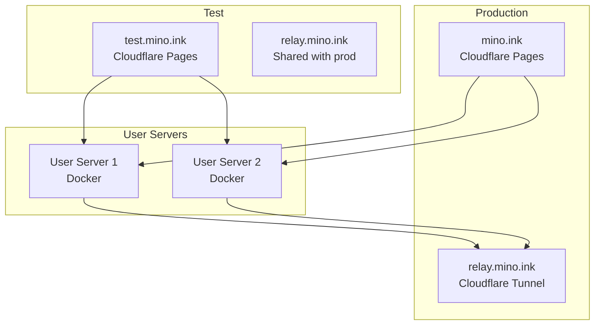

#### Environment Variables

| Variable                          | Production               | Test                     | Description            |
| --------------------------------- | ------------------------ | ------------------------ | ---------------------- |
| `NEXT_PUBLIC_APP_ENV`             | `production`             | `test`                   | Environment identifier |
| `NEXT_PUBLIC_APP_ORIGIN`          | `https://mino.ink`       | `https://test.mino.ink`  | App origin URL         |
| `NEXT_PUBLIC_DEFAULT_LINK_TARGET` | `https://mino.ink`       | `https://test.mino.ink`  | Default link target    |
| `NEXT_PUBLIC_RELAY_URL`           | `https://relay.mino.ink` | `https://relay.mino.ink` | Relay server URL       |

---

## 6. Configuration System

### 6.1 Configuration Hierarchy

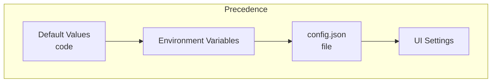

### 6.2 Server Configuration Schema

```typescript
// packages/shared/src/types/config.ts

interface ServerConfig {
	server: {
		port: number; // default: 3000
		host: string; // default: "0.0.0.0"
		cors: string[]; // allowed origins
	};
	auth: {
		mode: 'api-key' | 'jwt' | 'none';
		allowedOrigins: string[];
	};
	connection: {
		mode: 'relay' | 'open-port';
		relayUrl: string;
		publicServerUrl: string;
	};
	agent: {
		enabled: boolean;
		provider: 'anthropic' | 'openai' | 'google' | 'local' | '';
		model: string;
		apiKey: string;
		maxTokensPerRequest: number;
	};
	search: {
		fts: boolean;
		embeddings: boolean;
		embeddingProvider: 'openai' | 'local' | 'auto';
	};
	sync: {
		websocket: boolean;
		fileWatcher: boolean;
	};
	plugins: {
		enabled: string[];
		directory: string;
	};
	resources: {
		autoDetect: boolean;
		localWhisper: 'auto' | 'enabled' | 'disabled';
		localOCR: 'auto' | 'enabled' | 'disabled';
		localEmbeddings: 'auto' | 'enabled' | 'disabled';
	};
}
```

### 6.3 Environment Variables

| Variable                 | Default                  | Description                   |
| ------------------------ | ------------------------ | ----------------------------- |
| `MINO_DATA_DIR`          | `/data`                  | Data directory path           |
| `MINO_PORT`              | `3000`                   | Server port                   |
| `MINO_PORT_BIND`         | `0.0.0.0`                | Bind address                  |
| `MINO_CONNECTION_MODE`   | `relay`                  | Connection mode               |
| `MINO_RELAY_URL`         | `https://relay.mino.ink` | Relay server URL              |
| `MINO_PUBLIC_SERVER_URL` | -                        | Public URL for open-port mode |
| `MINO_WEB_DIST`          | -                        | Web UI dist directory         |

### 6.4 Feature Flags

```typescript
// Feature flags for progressive rollout

interface FeatureFlags {
	// Phase 2
	enableSQLiteIndex: boolean;
	enableWebSocketSync: boolean;

	// Phase 3
	enableSemanticSearch: boolean;
	enableAgentTools: boolean;

	// Phase 5
	enableMobileSync: boolean;
	enablePushNotifications: boolean;

	// Phase 7
	enableE2EEncryption: boolean;
	enableCollaboration: boolean;
}
```

---

## 7. Security Model

### 7.1 Authentication Flow

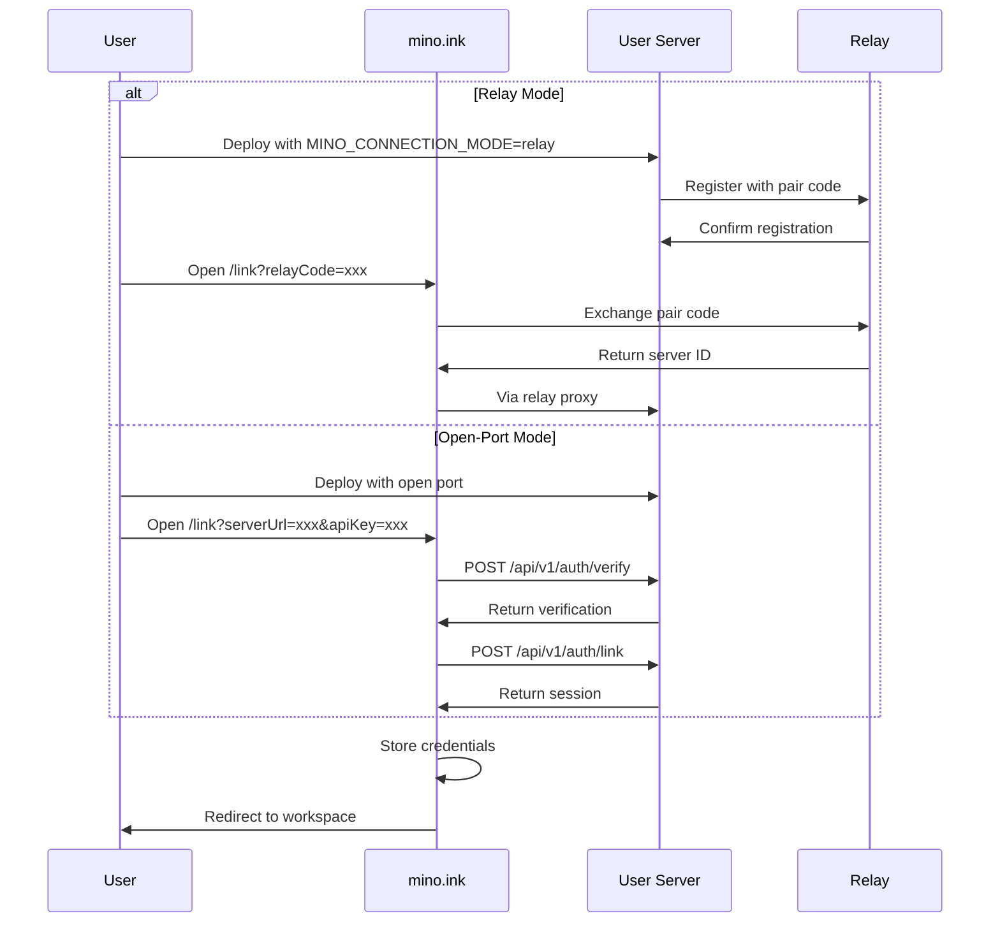

### 7.2 API Key Management

```typescript
// apps/server/src/bootstrap/credentials.ts

interface Credentials {
	serverId: string; // UUID
	adminApiKey: string; // mino_sk_xxx
	jwtSecret: string; // Auto-generated
	relayPairCode: string; // For relay mode
	relaySecret: string; // For relay mode
	createdAt: string;
	setupComplete: boolean;
}

// API key format: mino_sk_<32 random chars>
function generateApiKey(): string {
	const bytes = new Uint8Array(24);
	crypto.getRandomValues(bytes);
	return `mino_sk_${encodeBase32(bytes)}`;
}
```

### 7.3 Authorization Model

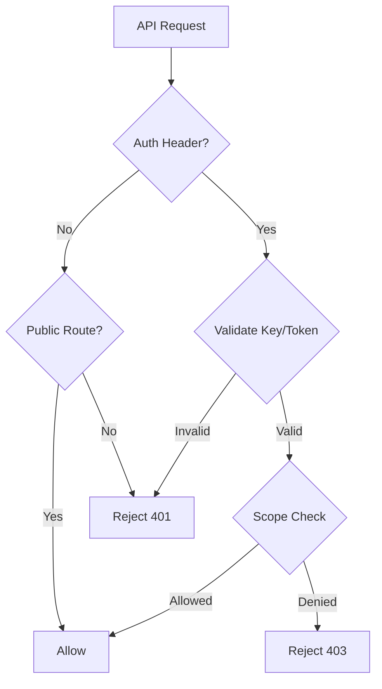

### 7.4 Security Headers

```typescript
// CORS configuration
const corsConfig = {
	origin: (origin: string) => {
		const allowed = [
			'https://mino.ink',
			'https://test.mino.ink',
			'http://localhost:3000'
		];
		return allowed.includes(origin);
	},
	methods: ['GET', 'POST', 'PUT', 'DELETE', 'PATCH'],
	allowedHeaders: ['Content-Type', 'X-Mino-Key', 'Authorization'],
	exposedHeaders: ['X-Request-Id'],
	credentials: true,
	maxAge: 86400
};

// CSP headers for web app
const cspDirectives = {
	'default-src': ["'self'"],
	'script-src': ["'self'", "'unsafe-inline'"],
	'style-src': ["'self'", "'unsafe-inline'", 'https://fonts.googleapis.com'],
	'font-src': ["'self'", 'https://fonts.gstatic.com'],
	'img-src': ["'self'", 'data:', 'https:'],
	'connect-src': ["'self'", 'https://*.mino.ink', 'wss://*.mino.ink']
};
```

### 7.5 Rate Limiting

```typescript
// apps/server/src/middleware/rate-limit.ts

interface RateLimitConfig {
	windowMs: number; // Time window
	maxRequests: number; // Max requests per window
	keyGenerator: (ctx: Context) => string;
}

const RATE_LIMITS = {
	// Per IP
	global: { windowMs: 60000, maxRequests: 1000 },

	// Per API key
	'api:read': { windowMs: 60000, maxRequests: 300 },
	'api:write': { windowMs: 60000, maxRequests: 100 },

	// Sensitive endpoints
	'auth:verify': { windowMs: 60000, maxRequests: 20 },
	'auth:link': { windowMs: 60000, maxRequests: 10 },

	// Agent
	'agent:chat': { windowMs: 60000, maxRequests: 30 }
};
```

---

## 8. Testing Strategy

### 8.1 Test Pyramid

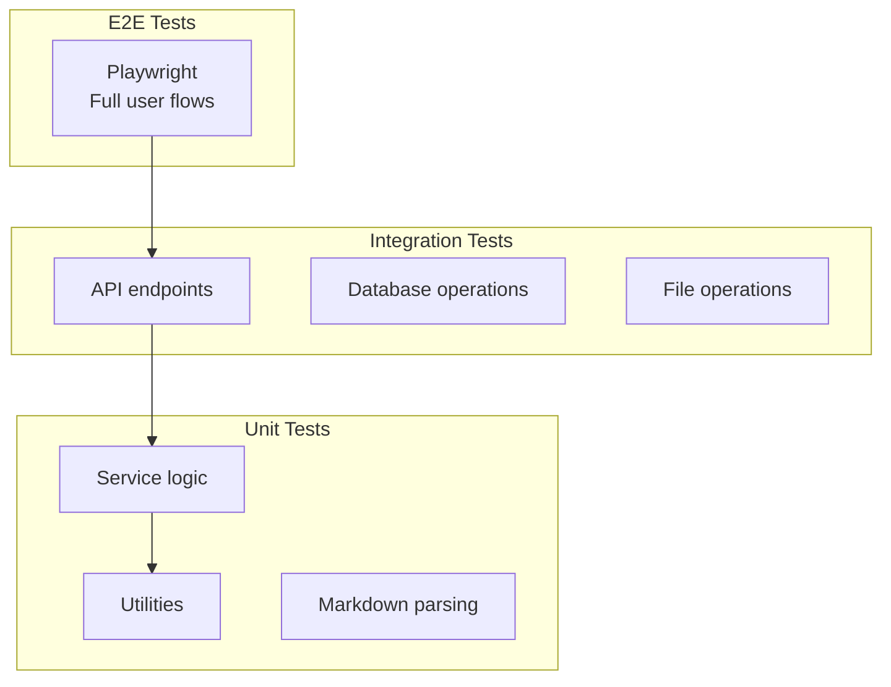

### 8.2 Test Organization

```
apps/server/tests/
├── helpers/
│   └── setup.ts              # Test utilities and fixtures
├── api.test.ts               # API endpoint tests
├── notes.test.ts             # Note service tests
├── bootstrap.test.ts         # Bootstrap process tests
├── config.test.ts            # Configuration tests
├── connect-links.test.ts     # Connect URL tests
├── rate-limit.test.ts        # Rate limiting tests
├── static-web.test.ts        # Static file serving tests
└── agent-channels-plugins.test.ts  # Integration tests

apps/web/tests/
├── docs.test.ts              # Documentation page tests
├── i18n.test.ts              # Internationalization tests
├── i18n-coverage.test.ts     # Translation coverage
├── plugins.test.ts           # Plugin utilities tests
├── rate-limit.test.ts        # Client rate limiting
├── settings.test.ts          # Settings management tests
├── storage.test.ts           # LocalStorage tests
└── url.test.ts               # URL handling tests
```

### 8.3 Test Patterns

#### Unit Test Example

```typescript
// apps/server/tests/notes.test.ts

import { describe, it, expect, beforeEach } from 'bun:test';
import { NoteService } from '../src/services/note-service';
import { createTestDir, cleanupTestDir } from './helpers/setup';

describe('NoteService', () => {
	let service: NoteService;
	let dataDir: string;

	beforeEach(async () => {
		dataDir = await createTestDir();
		service = new NoteService(dataDir);
	});

	afterEach(async () => {
		await cleanupTestDir(dataDir);
	});

	it('creates a note at the specified path', async () => {
		const note = await service.createNote(
			'test/note.md',
			'# Test Note\n\nContent here.'
		);

		expect(note.path).toBe('test/note.md');
		expect(note.title).toBe('Test Note');
		expect(note.wordCount).toBe(4);
	});

	it('returns null for non-existent notes', async () => {
		const note = await service.getNote('nonexistent.md');
		expect(note).toBeNull();
	});
});
```

#### Integration Test Example

```typescript
// apps/server/tests/api.test.ts

import { describe, it, expect } from 'bun:test';
import { createApp } from '../src/server';
import { createTestConfig, createTestCredentials } from './helpers/setup';

describe('API Endpoints', () => {
	const app = createApp({
		config: createTestConfig(),
		credentials: createTestCredentials(),
		dataDir: '/tmp/test-data',
		version: 'test'
	});

	it('GET /api/v1/health returns status', async () => {
		const res = await app.request('/api/v1/health');
		const data = await res.json();

		expect(res.status).toBe(200);
		expect(data.status).toBe('ok');
	});

	it('requires authentication for protected routes', async () => {
		const res = await app.request('/api/v1/notes');
		expect(res.status).toBe(401);
	});
});
```

### 8.4 Coverage Requirements

| Layer      | Minimum Coverage | Target |
| ---------- | ---------------- | ------ |
| Services   | 80%              | 90%    |
| Routes     | 70%              | 85%    |
| Utilities  | 90%              | 95%    |
| Middleware | 80%              | 90%    |

### 8.5 E2E Test Scenarios

```typescript
// e2e/workspace.spec.ts (future)

import { test, expect } from '@playwright/test';

test.describe('Workspace', () => {
	test('user can create and edit a note', async ({ page }) => {
		await page.goto('/workspace');

		// Create note
		await page.click('[data-testid="new-note"]');
		await page.fill('[data-testid="note-title"]', 'My Note');
		await page.fill('[data-testid="note-content"]', '# Content');

		// Verify save
		await expect(page.locator('[data-testid="save-indicator"]')).toHaveText(
			'Saved'
		);
	});

	test('command palette searches notes', async ({ page }) => {
		await page.goto('/workspace');
		await page.keyboard.press('Meta+K');

		await page.fill('[data-testid="command-input"]', 'project');
		await expect(
			page.locator('[data-testid="command-result"]')
		).toHaveCount(3);
	});
});
```

---

## Appendix A: Connection Modes

### Relay Mode (Default)

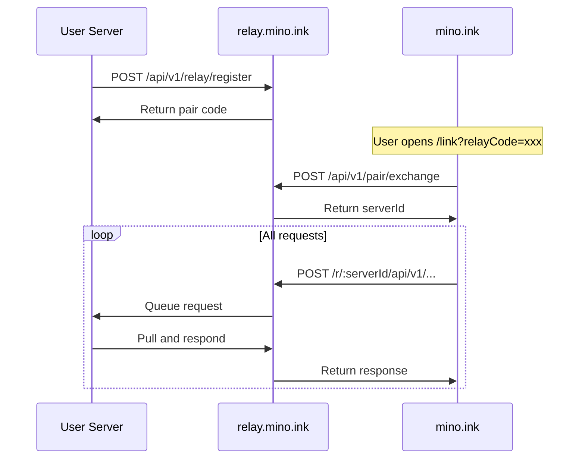

### Open-Port Mode

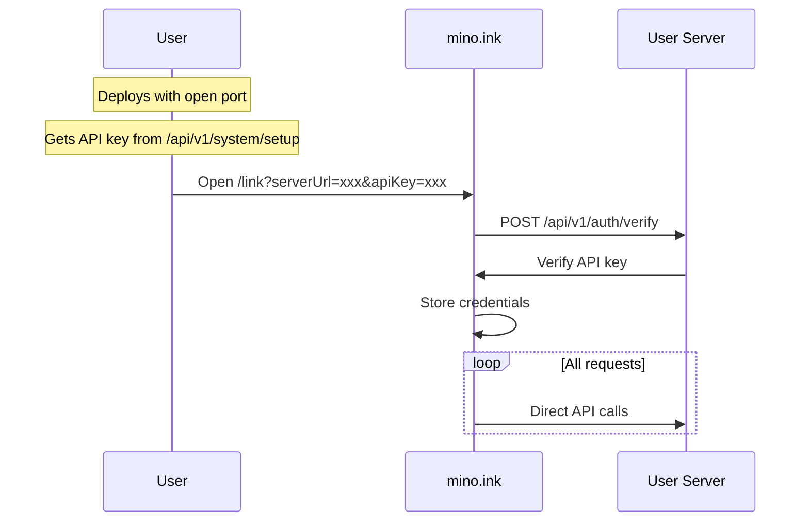

---

## Appendix B: Plugin Development

### Plugin Manifest Schema

```typescript
// plugin.json

interface PluginManifest {
	id: string;
	name: string;
	version: string;
	description?: string;
	source: 'builtin' | 'installed';
	defaultEnabled: boolean;
	channels?: ('web' | 'telegram' | 'whatsapp')[];
	configSchema?: {
		[key: string]: {
			type: 'string' | 'number' | 'boolean';
			default?: unknown;
			description?: string;
		};
	};
}
```

### Plugin SDK (Future)

```typescript
// @mino-ink/plugin-sdk

export function definePlugin(config: {
	name: string;
	description: string;
	requiresResources?: { ram?: string; binary?: string };
	tools: ToolDefinition[];
}): Plugin;
```

---

## Appendix C: Migration Path

### Phase Completion Checklist

#### Phase 0: Foundation ✅

- [x] Monorepo structure
- [x] `@mino-ink/shared` package
- [x] CI/CD pipeline
- [x] Dockerfile

#### Phase 1: Server Core ✅

- [x] Bun + Hono server
- [x] Auto-bootstrap
- [x] File system manager
- [x] REST API for notes
- [x] API key authentication
- [x] Plugin loader
- [x] Docker image

#### Phase 2: Web App (In Progress)

- [x] Next.js app with landing page
- [x] Workspace layout
- [x] Settings UI
- [x] Plugin marketplace UI
- [ ] Markdown editor (CodeMirror 6)
- [ ] Real-time sync via WebSocket
- [ ] Bundle static export into Docker

#### Phase 3: AI Agent (In Progress)

- [x] Agent runtime with tool system
- [x] Chat panel
- [ ] Core tools (search, read, write, edit, move, tree)
- [ ] Permission model
- [ ] Sandbox container

#### Phase 4-7: Future

- [ ] MCP server package
- [ ] Mobile app
- [ ] Plugin SDK
- [ ] Semantic search
- [ ] End-to-end encryption
